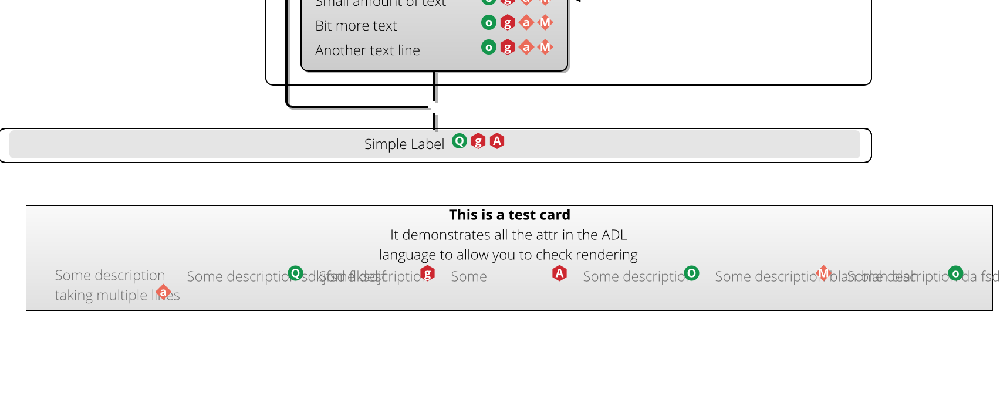

# 19th April 2016: Sprint 5: D3 To Load XML

- We should be able to render the XML returned by passing it through a simple d3 component which turns it into SVG.  DONE (24th April 2016)
- Tests should look like "here's some rendering information, handle it". DONE
- Using D3 to display on the screen.   DONE (10th May 2016)
- This should be a simple drop-in replacement to Raphael, and clear out this tech debt.
- (Bonus Goal) make sure animation still looks good, so handle updates.

## Prelude:  Content Types

Outputting SVG (or a web page containing SVG) is a *Content-Type* issue, and this is supported by the HTTP spec.  We should make
use of this.  The content types related to diagrams in Kite9 are:

 - **text/adl+xml** : Unrendered ADL (Kite9's internal XML Format).  
 - **text/rendered-adl+xml**:  Same as the above, but including rendering information to say where each element goes.
 - **application/pdf**:  PDF type
 - **image/png**: PNG Image format (the usual web format)
 - **image/svg+xml**:  SVG Images
 - **text/html**: Our rendered page, with an SVG image embedded in it.
 
To handle these in Spring, we use a [HttpMessageConverter](http://docs.spring.io/spring/docs/3.0.x/javadoc-api/org/springframework/http/converter/HttpMessageConverter.html)
subtype.  

By default, browsers handle a variety of content types themselves.  So, PNG, SVG and HTML would be handled automatically.  Then it would be up to the browser to ask 
for the right content type beyond this.

## Second Prelude: JavaScript

One of the reasons I'm doing this part of the project *right now* is that I want to get the JavaScript libraries sorted out properly.   I am going to use
`maven-frontend-plugin`, which combines several technologies:  Node.js, NPM, Webpack, and Karma.   I'm using these all at work as it is, and I'm going to now port them 
into this project to use.

This will actually be the main bulk of the project, I think.  

## Step 1: Rendering XML

For this we need two classes to encapsulate the XML, and therefore the content types.  To do all of that, I need an `ADLMessageConverter`,
and a class to hold the XML:

```java
public interface ADL {

	MediaType getMediaType();
	
	Diagram getAsDiagram();
	
	String getAsXMLString();

}
```

Implementation for this below.  You can initialize with either the xml or the `Diagram` object, and both getters will work:\\

```java
public class ADLImpl implements ADL {
		
	private Diagram diagram;
	private String xml;
	private final MediaType mt;
	
	public ADLImpl(String content, MediaType mt) {
		this.xml = content;
		this.mt = mt;
	}
	public ADLImpl(Diagram content, MediaType mt) {
		this.diagram = content;
		this.mt = mt;
	}

	@Override
	public Diagram getAsDiagram() {
		if (diagram == null) {
			diagram = (Diagram) new XMLHelper().fromXML(xml);
		}
		
		return diagram;
	}

	@Override
	public MediaType getMediaType() {
		return mt;
	}
	@Override
	public String getAsXMLString() {
		if (xml == null) {
			xml = new XMLHelper().toXML(diagram);
		}
		
		return xml;
	}	
}
```

### Media Types

And here are the `MediaType`s we are going to convert from/to:

```java
public class MediaTypes {

	public static final MediaType SVG = new MediaType("image", "svg+xml");
	public static final MediaType PDF = new MediaType("application", "pdf");
	public static final MediaType ADL_XML = new MediaType("text", "adl+xml");
	public static final MediaType RENDERED_ADL_XML = new MediaType("text", "rendered-adl+xml");
	public static final MediaType CLIENT_SIDE_IMAGE_MAP = new MediaType("text", "html-image-map");
	
}
```

The rest are available in the `MediaType` class already (e.g. PNG).

### The Converter

Ok, so now we need to implement the `ADLMessageConverter`:

```java
@Component
public class ADLMessageConverter extends AbstractHttpMessageConverter<ADL>{
	/**
	 * This is the list of media types we can support writing.
	 */
	public ADLMessageConverter() {
		super(MediaTypes.ADL_XML, MediaTypes.RENDERED_ADL_XML, MediaType.IMAGE_PNG, MediaTypes.SVG, MediaTypes.PDF, MediaType.TEXT_HTML);
	}

	@Override
	protected boolean supports(Class<?> clazz) {
		return ADL.class.isAssignableFrom(clazz);
	}
	
	/**
	 * List of things we can read in is much more limited than things we can write back out - just the XML formats, basically.
	 */
	@Override
	protected boolean canRead(MediaType mediaType) {
		return MediaTypes.ADL_XML.includes(mediaType) || MediaTypes.RENDERED_ADL_XML.includes(mediaType);
	}
```

So *reading* the POST body is much more limited, (to an XML format), and looks like this:

```java
	@Override
	protected ADL readInternal(Class<? extends ADL> clazz, HttpInputMessage inputMessage) throws IOException, HttpMessageNotReadableException {
		MediaType mt = inputMessage.getHeaders().getContentType();
		Charset charset = mt.getCharSet();
		ByteArrayOutputStream baos = new ByteArrayOutputStream(10000);
		StreamHelp.streamCopy(inputMessage.getBody(), baos, true);
		String s = baos.toString(charset.name());
		return new ADLImpl(s, mt);
	}
```

Writing is more complex.  If the client asks for unrendered XML, we simply return it.  Otherwise, we need to 
render any unrendered XML, and then select the correct `Format` object, and output it.  `Format` is a bit
of already-built Kite9 code that can render diagrams into the different formats.  

```java
	@Override
	protected void writeInternal(ADL t, HttpOutputMessage outputMessage) throws IOException, HttpMessageNotWritableException {
		MediaType contentType = outputMessage.getHeaders().getContentType();
		Charset charset = contentType.getCharSet() == null ? Charset.forName("UTF-8") : contentType.getCharSet();
		String stylesheet = StylesheetProvider.DEFAULT;  (1)
		
		if (MediaTypes.ADL_XML.isCompatibleWith(contentType)) { (2)
			outputMessage.getBody().write(t.getAsXMLString().getBytes(charset));
			return;
		}
			
		try {
			Diagram d = t.getAsDiagram();
			if (MediaTypes.ADL_XML.isCompatibleWith(t.getMediaType())) {
				// unrendered, so render.
				d = arranger.arrangeDiagram(d, stylesheet); (3)
			}

			Format f = formatSupplier.getFormatFor(contentType);  (4)
			Stylesheet ss = StylesheetProvider.getStylesheet(stylesheet);
			
			f.handleWrite(d, outputMessage.getBody(), ss, true, null, null);  (5)
		} catch (Exception e) {
			throw new HttpMessageNotReadableException("Caused by: "+e.getMessage(), e);
		}
		
	}
```

1.  Stylesheet is currently set to default.  Eventually it will be part of the Diagram object/xml.
2.  This returns unrendered XML, if that is what is asked for.
3.  Arranges the diagram.  This adds `RenderingInformation` objects to each element, telling them where they need to be placed.
4.  We choose the `Format` instance based on the requested Content-Type.
5.  Writes to the stream using the chosen `Format` instance.

### The Controller

Is ridiculously simple:  we are receiving POSTed XML in the HTTP Request, and then outputting it again in another format:

```java
@Controller
public class RenderingController {

	@RequestMapping(path="/api/renderer")
	public @ResponseBody ADL echo(@RequestBody ADL input, @RequestHeader HttpHeaders headers) {
		return input;
	}
}
```

Obviously, this will change in the future, and we will do caching, etc.

### Testing

I just wrote a simple test which creates a `Diagram` object, and then POSTs it.  The response is examined to check that
actually it's in the right format, and is passably likely to contain what I asked for. For example:

```java
public class RestRenderingIT extends AbstractAuthenticatedIT {
	
	private static final int EXPECTED_HEIGHT = 204;
	public static final int EXPECTED_WIDTH = 264;

	protected byte[] withBytesInFormat(MediaType output) throws URISyntaxException {
		String xml = createDiagramXML();
		HttpHeaders headers = createKite9AuthHeaders(u.getApi(), MediaTypes.ADL_XML, output);
		RequestEntity<String> data = new RequestEntity<String>(xml, headers, HttpMethod.POST, new URI(urlBase+"/api/renderer"));
		byte[] back = getRestTemplate().exchange(data);
		return back;
	}

	@Test
	public void testPNGRender() throws URISyntaxException, IOException {
		byte[] back = withBytesInFormat(MediaType.IMAGE_PNG);
		BufferedImage bi = ImageIO.read(new ByteArrayInputStream(back));
		Assert.assertEquals(EXPECTED_WIDTH, bi.getWidth());
		Assert.assertEquals(EXPECTED_HEIGHT, bi.getHeight());
	}
	
```

## Step 2:  A Web Page

Now that we have plumbed in the original Kite9 Visualization, and got it working, we need to produce a page
containing our diagram, rendered as SVG.  

To do this, I am going to use a React.js component, which will draw on the screen, and then render the D3 contained
within it.


http://localhost:8080/api/renderer/test

### Setting Up Maven-Frontend-Plugin

Ok, so broadly I am going to use the [Maven Frontend Plugin](https://github.com/eirslett/frontend-maven-plugin) to handle javascript packages and testing.   It includes `node`, `karma` and `webpack` integration.

```xml
<plugin>
		        <groupId>com.github.eirslett</groupId>
		        <artifactId>frontend-maven-plugin</artifactId>
		        <version>1.0</version>
	            <configuration>
	            	<installDirectory>target/frontend</installDirectory>
			        <workingDirectory>src/main/frontend</workingDirectory>
			    </configuration>
```
This says:

 - Download `node` into the `target/frontend` directory.  
 - Get the list of modules to download from `src/main/frontend/package.json`.

There are now *lots* of packages downloaded, but broadly they fall into a few categories:

 - Things to make testing work (in the `devDependencies` section).
 - Things to make `webpack` work (listed under the webpack dependency)
 - Things to make `react` work (stuff at the top of the dependency list).
 
### Webpack

[Webpack](http://webpack.github.io) is a brain-bending creation that allows you to package up javascript (and css, fonts, etc) into
*bundles*, which can then be served as a single HTTP request.  

ES6 now includes the `import` directive, so, Webpack looks for these and resolves them to build large javascript modules.  The entry-point
of our application will be `app.jsx`, and this will import various other resources like this:

```
import React from 'react';
import { render } from 'react-dom'
import ADLSpace from './adl/components/ADLSpace.jsx'
```

Webpack has a config file `webpack.config.js`, which contains details about the *inputs* and *outputs*, and the transforms that need to apply
in the middle:

```js
module.exports = {
	...
    
    entry: {
    	bundle:  './app.jsx'
    },
    output: {
        path: __dirname + "/../../../target/classes/static/dist",
        filename: "bundle.js"
    },

    module: {
    	loaders: [
    	   ...
    	   { test: /\.less$/, loader: "style!css!less" },
    	   { test: /\.css$/, loader: "style!css" },
    	   { test: /\.(png|woff|woff2|eot|ttf|svg)$/, loader: "url-loader?limit=1000000" } 
    	]    	
    }

}
```

So the loaders are chained together.  The less loader for example chains, `less-loader`, `css-loader` and `style-loader` in that order, 
and bundles the output into the same bundle.js file as everything else goes in.

Note that webpack is building into the `target/classes` directory, which allows us to have a refreshing loader when we run:

```sh
mvn frontend:npm 
```

### Setting up React

`.jsx` is an extension for React files which allows them to include snippets of HTML which will be unpacked into React template code.

So our app.jsx calls this:

```js
render(
		<App />,
		document.getElementById('react')
)
```

Which renders the <App /> react module into the `react` element on the page.   At the moment, <App /> just renders to `Hello World`.

### HTMLFormat

Finally, we are ready to construct the `HTMLFormat` code, which will output our `ADLImpl` as a webpage, which effectively means just outputting this:

```html
<!DOCTYPE html>
	<html>
	<head lang="en">
	    <meta charset="UTF-8"/>
	    <title>Kite9</title>
	</head>
	<body>
		{content}
	
	    <div id="react"></div>

	    <script src="/dist/bundle.js"></script>

	</body>
</html>
```

The built webpack code, containing the `<App />` react template is loaded in from the `/dist/bundle.js` file, and rendered on the screen,
inside the `react` element.

This can be easily run in a browser, and is the default format, since browsers ask for the `text/html` content-type when they request the page.  
Again, I am skipping the choice of view/templating code on the server side as it's just not needed yet.

## Step 3: Further Design Work

### Groups

This is something we can plausibly do now:  each rendering element can be a group.

### Kite9 Control Object

This is the way you register callbacks and things.   We're still going to need this. I think when we set up our ADLSpace object, we should pass
in a set of functions, which register behaviours on this control object.  When we render an ADLSpace, we are going to be doing it sometimes as a full-screen thing, and sometimes as a dialog box for a palette, and sometimes as just a menu page.
So, it makes sense that the behaviours are going to need to be passed in somehow separately.

 i.e. each function is like:

```javascript
function someRegister(control) {
	...
}
```
So, the ADLSpace will create one of these, and then pass it round to load up with behaviours.

### Rendering in the future

*I believe* that we should base rendering entirely of the content of **renderingInformation**.  This way we achieve separation in the gui of 
before and after.  This way, we could take any given tag with an ID, and call render on it.  In fact, I am not going to go 
crazy on rendering client-side for now because of this.  I'm just going to get the basics in place and worry about fine-grained
rendering later, by changing the model. 

So, in this world, rendering information would contain an SVG "payload".  We would construct a group for the id'd element, and then 
dump the SVG payload into the group.  Things like offset / size and so on could also be set here.  I expect there is a way of 
using Batik to handle this outputting.

### D3?  

I am looking less favourably on this now.  I only really need animation - everything else is just straight svg.  I think making the animation in 
some way pluggable is a good idea.  So, I'd like to downplay this and try to do things in basic SVG for the time being.

### With Raphael for now?

Seems like an easier win.  Let's bring this in, and then slowly reactify/webpackify/derephaelify...

### Initial import

So, to start with, I want a react component that actually renders some SVG on the screen.  I'm going to import the old Kite9
code for now, and get this displaying to give a base from which to improve things.

This is the entire component for rendering some SVG:

```js
import React from 'react'
import ReactDOM from 'react-dom'
import jQuery from 'jquery'
import setup_rendering from '../lib/kite9_rendering'
import setup_primitives from '../lib/kite9_primitives'
import setup_style_chooser from '../lib/kite9_style_chooser'

import Raphael from 'raphael'

class ADLSpace extends React.Component {

	render() {
		return (<svg id="ADLSpace" width="1000" height="1000"></svg>)
	}
	
	componentDidMount() {
		var dom = ReactDOM.findDOMNode(this);

		var kite9 = {}; 
		kite9.isTouch = jQuery("html").hasClass("touch");
		jQuery("body").addClass(kite9.isTouch ? "touch" : "mouse");
		setup_primitives(kite9);
		setup_rendering(kite9);
		kite9.main_control = kite9.new_control(Raphael("ADLSpace", 1, 1), dom);
        setup_style_chooser(kite9, kite9.main_control);
		kite9.load(kite9.main_control, "http://localhost:8080/dist/test-card-rendered.xml", undefined);
	}
}


export default ADLSpace
```

Effectively, we are not changing much here: we're still using Raphael, and we're loading the XML from a pre-rendered file (the test card).
I had to add Raphael to the `package.json` (for now), and also create hard-coded copies of the stylesheets for webpack. 

But, it mainly seems to work:


 - Fonts are wrong (webpack wants to add them to the bundle)
 - Background colours are also not present for some reason.
 
I think I can live with this:  it's a reasonable starting point to begin with removing the Raphael dependency.

## Step 3: Removing Raphael, Tidying Up

So there's still a bit of a mess here:

1.  We've got three large javascript files which control all the loading/updating rendering. 
2.  Two of them are referencing Raphael.
3.  They're all doing lots of XML manipulation, which in the future I think will just *go*.

I need to decide whether to pause this, and do the `renderingInformation` change, or try and pull out the Raphael.  Obviously, doing the R.I. change will *massively*
reduce the amount of XML we are importing, so maybe this is a good idea.

Also, we need to do the grouping change.  But, I definitely want to do that after renderingInformation.  So...
 
## Spike Solution: Rendering SVG Within Kite9 Visualisation

Some of this turned out to be easy:   I used Batik's `SVGGraphics2D` class to create a new SVGRenderer class in Kite9.  What doesn't work:

 - By default, Kite9 renders all the fonts into shapes before adding them to the graphics, so you end up with a much larger
SVG file than you expect (all the paths to describe each character).  
 - Any kind of fill, including background fills
 - Shadows
 - Literally *everything* is encoded on a per-element basis.. stylesheets are completely out-of-the-question.
 
 But on the plus side, it's pretty exact.  By not using text, I wonder if this improves speed?  Hard to say.

So, I could just spend the rest of this sprint sorting this out, and that would be great.  Is this worth doing? I think, yes:
if we can plug this into the rendering information, it's going to simplify things massively, and that's a huge win, 
and it should knock out the Raphael problem at the same time.  (Animation is likely to be made harder though I think).

### Fixing Background Fills + Shadows

 - Batik comes with it's own `LinearGradientPaint`.  Maybe I should use this instead of the AWT one?
 
Trying [this handler](https://gist.github.com/msteiger/4509119) from the internet.  This works really well and solves the issue of Gradient fills not being
supported.  I had to make a couple of changes:

1.  `LinearGradientPaint` is the object used in Java to represent the gradient fill.  However, I wrap one of these so that I can use the same paint for any size of
glyph.  This means it's not a `LinearGradientPaint` when it gets the handler.  So, I unwrap it first.
2.  As a result of (1), I have to modify the handler class to use percentages for gradient start/end points, which is pretty simple.
3.  Naively, each element with a gradient paint gets their gradient converted separately, e.g.

```xml
<linearGradient xmlns="http://www.w3.org/2000/svg" x1="50.0%" x2="50.0%" y1="0.0%" style="color-interpolation:sRGB;" y2="100.0%" id="gradient1" spreadMethod="pad"><stop style="stop-color:rgb(242,242,242);" offset="0%"/><stop style="stop-color:rgb(204,204,204);" offset="100%"/></linearGradient>
<linearGradient xmlns="http://www.w3.org/2000/svg" x1="50.0%" x2="50.0%" y1="0.0%" style="color-interpolation:sRGB;" y2="100.0%" id="gradient1" spreadMethod="pad"><stop style="stop-color:rgb(242,242,242);" offset="0%"/><stop style="stop-color:rgb(204,204,204);" offset="100%"/></linearGradient>
<linearGradient xmlns="http://www.w3.org/2000/svg" x1="50.0%" x2="50.0%" y1="0.0%" style="color-interpolation:sRGB;" y2="100.0%" id="gradient1" spreadMethod="pad"><stop style="stop-color:rgb(242,242,242);" offset="0%"/><stop style="stop-color:rgb(204,204,204);" offset="100%"/></linearGradient>
...
```

This is pointless duplication, so I introduced a cache.  But there is something called `GradientPaintValueManager` which I wrote to convert between Raphael's idea 
of gradients, and the one in Batik/Java.  So, this will need to be removed at some point soon.

What's the right way to do this?  I guess, if we are using CSS generally, then we will need some CSS for fill gradients, and Raphael's approach is both working and OK.
So, maybe we're barking up the wrong tree by removing this.  For now, I've added the fill property as the key for the cache, so that we can cache the gradients.  This fixes the problem, but 
on the whole this bit is messy now.

### Fixing the TestCard

 - Stuff seems to be offset incorrectly is all. This turned out to be because we had zero-size connection 
 bodies in the diagram, which, if you try to draw them cause the masks to go out of whack.  Easily fixed.
 
Now we have a bunch of visualisation code to check in, including new tests:  it's time to bite the bullet, get a github private repo and check this stuff in there.
Also, I need to check in the SVG, so that we can use it as a baseline when running the tests.


### Adding the SVG To The Rendering Information

Ok, this is a tricky bit. Ideally, the rendering information will be contained within the existing XML.  But, we have different *layers* to take care of: the shadow, the foreground 
and the 'flannel' (the layer with the interactivity).  

For a typical Glyph, the SVG looks like this (comments added by me):

```xml
		<!-- SHADOW --> 
		<g
			style="fill:rgb(179,179,179); text-rendering:optimizeLegibility; color-interpolation:linearRGB; color-rendering:optimizeQuality; stroke:rgb(179,179,179); image-rendering:optimizeQuality;">
			<rect x="14.5" y="14.5" width="95" style="stroke:none;" rx="6"
				ry="6" height="47" />
		</g> 

		
		<g style="fill:url(#gradient1); text-rendering:optimizeLegibility; color-interpolation:linearRGB; color-rendering:optimizeQuality; stroke:url(#gradient1); image-rendering:optimizeQuality;">
			

			<!-- BACKGROUND -->
			<rect x="12.5" y="12.5" width="95" style="stroke:none;" rx="6" ry="6" height="47" />

			<!-- BORDER -->
			<rect x="12.5" y="12.5" width="95" style="fill:none; stroke:black;" rx="6" ry="6" height="47" /> 
			<!-- STEREO -->
			<path
				d="M41.5469 29.0938 L41.5469 27.4062 Q42.4219 27.7969 43.0234 27.9531 Q43.625 28.1094 44.125 28.1094 Q44.7188 28.1094 45.0391 27.8828 Q45.3594 27.6562 45.3594 27.2031 Q45.3594 26.9531 45.2188 26.7578 Q45.0781 26.5625 44.8047 26.3828 Q44.5312 26.2031 43.6875 25.7969 Q42.9062 25.4375 42.5156 25.0938 Q42.125 24.75 41.8906 24.2969 Q41.6562 23.8438 41.6562 23.25 Q41.6562 22.1094 42.4219 21.4609 Q43.1875 20.8125 44.5469 20.8125 Q45.2188 20.8125 45.8281 20.9688 Q46.4375 21.125 47.0938 21.4062 L46.5156 22.8281 Q45.8281 22.5469 45.375 22.4375 Q44.9219 22.3281 44.5 22.3281 Q43.9844 22.3281 43.7031 22.5625 Q43.4219 22.7969 43.4219 23.1875 Q43.4219 23.4219 43.5391 23.6016 Q43.6562 23.7812 43.8984 23.9531 Q44.1406 24.125 45.0469 24.5469 Q46.25 25.125 46.6953 25.7031 Q47.1406 26.2812 47.1406 27.125 Q47.1406 28.2812 46.3047 28.9531 Q45.4688 29.625 43.9844 29.625 Q42.6094 29.625 41.5469 29.0938 ZM47.8906 24.2969 L47.8906 23.5312 L48.875 22.9375 L49.3906 21.5469 L50.5312 21.5469 L50.5312 22.9531 L52.3594 22.9531 L52.3594 24.2969 L50.5312 24.2969 L50.5312 27.4531 Q50.5312 27.8281 50.7422 28.0078 Q50.9531 28.1875 51.3125 28.1875 Q51.7812 28.1875 52.4375 27.9844 L52.4375 29.3125 Q51.7656 29.625 50.7969 29.625 Q49.7188 29.625 49.2266 29.0781 Q48.7344 28.5312 48.7344 27.4531 L48.7344 24.2969 L47.8906 24.2969 ZM53.3652 26.2656 Q53.3652 24.625 54.1855 23.7266 Q55.0059 22.8281 56.459 22.8281 Q57.8496 22.8281 58.623 23.6172 Q59.3965 24.4062 59.3965 25.7969 L59.3965 26.6719 L55.1621 26.6719 Q55.1934 27.4375 55.6152 27.8594 Q56.0371 28.2812 56.8027 28.2812 Q57.3965 28.2812 57.9199 28.1641 Q58.4434 28.0469 59.0215 27.7656 L59.0215 29.1562 Q58.5527 29.3906 58.0215 29.5078 Q57.4902 29.625 56.7246 29.625 Q55.1465 29.625 54.2559 28.75 Q53.3652 27.875 53.3652 26.2656 ZM55.209 25.4844 L57.7246 25.4844 Q57.709 24.8125 57.373 24.4531 Q57.0371 24.0938 56.4746 24.0938 Q55.8965 24.0938 55.5762 24.4531 Q55.2559 24.8125 55.209 25.4844 ZM60.8457 29.5 L60.8457 22.9531 L62.2051 22.9531 L62.4707 24.0469 L62.5488 24.0469 Q62.8613 23.5 63.377 23.1641 Q63.8926 22.8281 64.502 22.8281 Q64.8613 22.8281 65.1113 22.875 L64.9707 24.5469 Q64.752 24.5 64.4395 24.5 Q63.5957 24.5 63.1113 24.9375 Q62.627 25.375 62.627 26.1719 L62.627 29.5 L60.8457 29.5 ZM65.9043 26.2656 Q65.9043 24.625 66.7246 23.7266 Q67.5449 22.8281 68.998 22.8281 Q70.3887 22.8281 71.1621 23.6172 Q71.9355 24.4062 71.9355 25.7969 L71.9355 26.6719 L67.7012 26.6719 Q67.7324 27.4375 68.1543 27.8594 Q68.5762 28.2812 69.3418 28.2812 Q69.9355 28.2812 70.459 28.1641 Q70.9824 28.0469 71.5605 27.7656 L71.5605 29.1562 Q71.0918 29.3906 70.5605 29.5078 Q70.0293 29.625 69.2637 29.625 Q67.6855 29.625 66.7949 28.75 Q65.9043 27.875 65.9043 26.2656 ZM67.748 25.4844 L70.2637 25.4844 Q70.248 24.8125 69.9121 24.4531 Q69.5762 24.0938 69.0137 24.0938 Q68.4355 24.0938 68.1152 24.4531 Q67.7949 24.8125 67.748 25.4844 ZM72.9941 26.2188 Q72.9941 24.6094 73.8301 23.7188 Q74.666 22.8281 76.1816 22.8281 Q77.1191 22.8281 77.8457 23.2344 Q78.5723 23.6406 78.9551 24.4141 Q79.3379 25.1875 79.3379 26.2188 Q79.3379 27.8125 78.4941 28.7188 Q77.6504 29.625 76.1504 29.625 Q75.1973 29.625 74.4785 29.2109 Q73.7598 28.7969 73.377 28.0234 Q72.9941 27.25 72.9941 26.2188 ZM74.8066 26.2188 Q74.8066 27.1875 75.127 27.6875 Q75.4473 28.1875 76.166 28.1875 Q76.8848 28.1875 77.1973 27.6875 Q77.5098 27.1875 77.5098 26.2188 Q77.5098 25.2344 77.1973 24.75 Q76.8848 24.2656 76.1504 24.2656 Q75.4473 24.2656 75.127 24.75 Q74.8066 25.2344 74.8066 26.2188 Z"
				style="fill:rgb(112,112,112); stroke:none;" /> 
		</g>

		<!-- LABEL --> 
		<g
			style="text-rendering:optimizeLegibility; font-size:15; font-family:&apos;Open Sans&apos;; color-interpolation:linearRGB; color-rendering:optimizeQuality; image-rendering:optimizeQuality;">
			<path style="stroke:none;"
				d="M21.5156 49.5 L21.5156 38.7969 L24.0625 38.7969 Q26.0625 38.7969 27.0156 39.5312 Q27.9688 40.2656 27.9688 41.75 Q27.9688 42.8125 27.3984 43.5547 Q26.8281 44.2969 25.6719 44.625 L28.5781 49.5 L27.6875 49.5 L24.9219 44.8281 L22.2656 44.8281 L22.2656 49.5 L21.5156 49.5 ZM22.2656 44.1875 L24.3125 44.1875 Q25.6562 44.1875 26.4062 43.5859 Q27.1562 42.9844 27.1562 41.7969 Q27.1562 40.5781 26.4219 40.0234 Q25.6875 39.4688 24.0312 39.4688 L22.2656 39.4688 L22.2656 44.1875 ZM29.7886 45.5156 Q29.7886 43.5625 30.7339 42.4766 Q31.6792 41.3906 33.3198 41.3906 Q34.9604 41.3906 35.8979 42.4922 Q36.8354 43.5938 36.8354 45.5156 Q36.8354 47.4531 35.8901 48.5469 Q34.9448 49.6406 33.2729 49.6406 Q32.2261 49.6406 31.4292 49.1406 Q30.6323 48.6406 30.2104 47.6953 Q29.7886 46.75 29.7886 45.5156 ZM30.5542 45.5156 Q30.5542 47.1562 31.2729 48.0703 Q31.9917 48.9844 33.312 48.9844 Q34.6323 48.9844 35.3511 48.0703 Q36.0698 47.1562 36.0698 45.5156 Q36.0698 43.8594 35.3433 42.9531 Q34.6167 42.0469 33.2964 42.0469 Q31.9761 42.0469 31.2651 42.9531 Q30.5542 43.8594 30.5542 45.5156 ZM39.0308 49.5 L39.0308 38.1094 L39.7651 38.1094 L39.7651 40.9688 Q39.7651 41.6094 39.7339 42.1562 L39.7026 42.7812 L39.7651 42.7812 Q40.2183 42.0625 40.8589 41.7266 Q41.4995 41.3906 42.3901 41.3906 Q44.062 41.3906 44.9136 42.4375 Q45.7651 43.4844 45.7651 45.5156 Q45.7651 47.5 44.8745 48.5703 Q43.9839 49.6406 42.3745 49.6406 Q41.5151 49.6406 40.8354 49.2891 Q40.1558 48.9375 39.7651 48.2969 L39.7026 48.2969 L39.4839 49.5 L39.0308 49.5 ZM39.7651 45.625 Q39.7651 47.4375 40.3979 48.2188 Q41.0308 49 42.3745 49 Q43.6714 49 44.3276 48.0859 Q44.9839 47.1719 44.9839 45.5 Q44.9839 42.0469 42.3901 42.0469 Q40.9839 42.0469 40.3745 42.8516 Q39.7651 43.6562 39.7651 45.5156 L39.7651 45.625 ZM47.5996 38.7969 L48.5371 38.7969 L48.2871 42.6562 L47.8496 42.6562 L47.5996 38.7969 ZM50.1187 49.1562 L50.1187 48.375 Q51.3218 48.9688 52.6655 48.9688 Q53.8374 48.9688 54.4468 48.5781 Q55.0562 48.1875 55.0562 47.5312 Q55.0562 46.9375 54.5718 46.5234 Q54.0874 46.1094 52.978 45.7188 Q51.7749 45.2812 51.2905 44.9766 Q50.8062 44.6719 50.564 44.2734 Q50.3218 43.875 50.3218 43.3125 Q50.3218 42.4219 51.0718 41.9062 Q51.8218 41.3906 53.1655 41.3906 Q54.4624 41.3906 55.6187 41.875 L55.353 42.5312 Q54.1812 42.0469 53.1655 42.0469 Q52.1968 42.0469 51.6265 42.3672 Q51.0562 42.6875 51.0562 43.2656 Q51.0562 43.875 51.5015 44.25 Q51.9468 44.625 53.228 45.0938 Q54.3062 45.4844 54.7983 45.7891 Q55.2905 46.0938 55.5327 46.4922 Q55.7749 46.8906 55.7749 47.4219 Q55.7749 48.5 54.9624 49.0703 Q54.1499 49.6406 52.6655 49.6406 Q51.0562 49.6406 50.1187 49.1562 ZM61.3306 44.1562 Q61.3306 42.5312 62.0024 41.2656 Q62.6743 40 63.9243 39.3125 Q65.1743 38.625 66.7993 38.625 Q68.5493 38.625 69.9399 39.2656 L69.6431 39.9375 Q68.2524 39.2969 66.7524 39.2969 Q64.6274 39.2969 63.3931 40.6016 Q62.1587 41.9062 62.1587 44.125 Q62.1587 46.5469 63.3306 47.7656 Q64.5024 48.9844 66.7993 48.9844 Q68.2681 48.9844 69.2993 48.5625 L69.2993 44.8125 L66.1274 44.8125 L66.1274 44.1094 L70.0649 44.1094 L70.0649 48.9844 Q68.5181 49.6406 66.5806 49.6406 Q64.0337 49.6406 62.6821 48.2109 Q61.3306 46.7812 61.3306 44.1562 ZM72.5684 49.5 L72.5684 38.1094 L73.3027 38.1094 L73.3027 49.5 L72.5684 49.5 ZM74.6313 41.5312 L75.3813 41.5312 L77.0688 46 Q77.8345 48.0625 78.0376 48.7812 L78.0845 48.7812 Q78.3813 47.8438 79.0845 45.9688 L80.772 41.5312 L81.522 41.5312 L77.9438 50.7969 Q77.522 51.9219 77.2251 52.3125 Q76.9282 52.7031 76.5376 52.9062 Q76.147 53.1094 75.5845 53.1094 Q75.1782 53.1094 74.6626 52.9531 L74.6626 52.3125 Q75.0845 52.4375 75.5688 52.4375 Q75.9438 52.4375 76.2329 52.2578 Q76.522 52.0781 76.7485 51.7109 Q76.9751 51.3438 77.2876 50.5469 L77.6782 49.5 L74.6313 41.5312 ZM82.8442 53.1094 L82.8442 41.5312 L83.4692 41.5312 L83.6099 42.6719 L83.6411 42.6719 Q84.4692 41.3906 86.2661 41.3906 Q87.8755 41.3906 88.7271 42.4453 Q89.5786 43.5 89.5786 45.5156 Q89.5786 47.4844 88.688 48.5625 Q87.7974 49.6406 86.2505 49.6406 Q84.4224 49.6406 83.5786 48.2656 L83.5161 48.2656 L83.5474 48.8906 Q83.5786 49.4219 83.5786 50.0781 L83.5786 53.1094 L82.8442 53.1094 ZM83.5786 45.5312 Q83.5786 47.4062 84.2036 48.2031 Q84.8286 49 86.2349 49 Q87.4692 49 88.1333 48.0938 Q88.7974 47.1875 88.7974 45.5469 Q88.7974 42.0469 86.2661 42.0469 Q84.8755 42.0469 84.2271 42.8125 Q83.5786 43.5781 83.5786 45.2969 L83.5786 45.5312 ZM91.7725 49.5 L91.7725 38.1094 L92.5068 38.1094 L92.5068 41.7344 L92.46 42.75 L92.5225 42.75 Q92.96 42.0312 93.6396 41.7109 Q94.3193 41.3906 95.335 41.3906 Q98.0537 41.3906 98.0537 44.2969 L98.0537 49.5 L97.335 49.5 L97.335 44.3438 Q97.335 43.1406 96.8271 42.5938 Q96.3193 42.0469 95.2568 42.0469 Q93.835 42.0469 93.1709 42.7656 Q92.5068 43.4844 92.5068 45.1094 L92.5068 49.5 L91.7725 49.5 Z" />
		</g> 
```

 - It's interesting that the label is within a separate group to the stereo and the rest of it:  I wonder why this is?

If it weren't, this would make life a bit simpler I think.  My plan is to add some methods to the Graphics2D object so that we can tell it where to put each bit of XML as it goes along.

### Rendering Per Element

For each on-screen element, there can be several layers.  Stuff is added to the graphics context from the bottom layer to the top.  We have the notion of this already
in `GraphicsSourceRenderer`, but I've now made this specific:

```java
public interface GraphicsSourceRenderer<X> extends Renderer<X> {

	/**
	 * Returns a graphics context that the displayer can use.
	 */
	public GraphicsLayer getGraphicsLayer(GraphicsLayerName layer, float transparency, Dimension2D size);
	
	public void setDisplayer(RequiresGraphicsSourceRendererCompleteDisplayer cd);
	
	/**
	 * Returns the size of the image for a given diagram size.
	 */
	public Dimension2D getImageSize(Dimension2D diagramSize);
}
```

So you pass in a `GraphicsLayerName` and get a `GraphicsLayer` object back. 

```java
public enum GraphicsLayerName {

	BACKGROUND, SHADOW, MAIN, FLANNEL, WATERMARK, COPYRIGHT, DEBUG
}
```

`GraphicsLayer` is an interface which matches the used methods of `Graphics2D`, but contains two extra ones:

```java
public interface GraphicsLayer {
	
	/**
	 * Use this to indicate we have started processing a diagram element.
	 */
	public void startElement(DiagramElement de);
	
	/**
	 * Use this to indicate end of processing.
	 */
	public void endElement();
	
	...
	
	// draw(Shape), fill(Shape) etc.
}
```

This means we can use a `BasicGraphicsLayer` (which is a simple adapter for an actual `Graphics2D` object, or we can
use a new `SVGGraphicsLayer`, which manipulates the DOM tree to add in the extra groups we need:

```java

public class SVGGraphicsLayer extends BasicGraphicsLayer {
	
	...
	
	public void startElement(DiagramElement de) {
		Element group = document.createElement("g");
		group.setAttribute("layer", name.name());
		if (de instanceof IdentifiableDiagramElement) {
			group.setAttribute("element-id", ((IdentifiableDiagramElement) de).getID());
		}
		
		((SVGGraphics2D)g2).setTopLevelGroup(group);
		super.startElement(de);
	}

	public void endElement() {
		Element topGroup = ((SVGGraphics2D)g2).getTopLevelGroup();
		if (topGroup.getChildNodes().getLength() > 0) {
			originalTopGroup.appendChild(topGroup);
		}
		
		super.endElement();
		((SVGGraphics2D)g2).setTopLevelGroup(topGroup);
	}
```

Now, the XML looks like this:

```xml
<svg ...
  <g><defs id="defs1"><linearGradient x1="50.0%" x2="50.0%" y1="0.0%" style="color-interpolation:sRGB;" y2="100.0%" id="gradient1" spreadMethod="pad"><stop style="stop-color:rgb(242,242,242);" offset="0%"/><stop style="stop-color:rgb(204,204,204);" offset="100%"/></linearGradient></defs>

    ...
	<g element-id="RG" layer="SHADOW">
	   <g style="fill:rgb(179,179,179);... /></g>
	</g>
```

So, we have correctly separated out the different *layers* and *diagram elements* in our svg output.  

Then, when it comes to streaming the XML, we can redirect the different parts into the different `<renderingInformation>` objects:


```java
public abstract class AbstractRenderingInformation implements RenderingInformation {
	
	...
	@XStreamAsAttribute
	protected boolean rendered = true;
	protected Object displayData;

	public Object getDisplayData() {
		return displayData;
	}

	public void setDisplayData(Object displayData) {
		this.displayData = displayData;
	}
	
```

And `displayData` would simply be an object containing some SVG, so the parts from the previous block of XML would just be held in different map elements.

```java
/**
 * Contains rendering information for drawing components in SVG format.
 * 
 * @author robmoffat
 */
public class SVGData {

	public static final String SHADOW = "SHADOW";
	public static final String PERIMETER = "PERIMETER";
	public static final String BODY = "BODY";
	
	private Map<String, String> svgParts = new HashMap<>();

	private Dimension2D offset;

	public void setPathOffset(Dimension2D offset) {
		this.offset = offset;
	}
	
	public Dimension2D getPathOffset() {
		return this.offset;
	}

	public void setSvgPart(String name, String value) {
		this.svgParts.put(name, value);
	}

	public String getPart(String name) {
		return svgParts.get(name);
	}

}
```

A few questions arising from this:

1.  What would you do about fonts / icons / textures?  These would need to be held at document-level, so that would need some extra thought.
2.  The hard part is, how to we interrupt the stream of commands going to the `Graphics2D` context, in order to divide the work up amongst the different parts / elements?
  - Since Graphics2D isn't an interface, we can't add any methods to it... although perhaps we could create an interface that Graphics2D can implement?

### Converting To XML

- Need to write a Test for this. Also a test for embedding within ADL.


### Rendering it on-screen

Talk about d3 code here.

### Minimizing/Converting Defs

-- adding to diagram.

### Converting svg default style

-- style element on 'svg', (making sure it's a single attribute)

Now we are up to here:



A couple of things are definitely wrong here:

 - The join-point on the connection is missing
 - The key is rendering all over the place.
 
However, it's working "enough" that I can forget about this now and focus on some of the main things to get right.

### Fonts / Support / PositionInfoRenderer

There is a *huge* performance improvement to be made from rendering fonts on the client side rather 
than the server.   So, this is the next job.

**Sometimes, fonts don't get loaded up properly - maybe a memory issue, or something to do with Spring application
context reloading?**

- Added the controller
- Deriving font family.


### Simplifying the SVG

-- Leaving this for now.  Although, I think animations will be improved if we have it.


### Animating Between Versions

This is the last remaining thing to test.  I guess one way I could do this is add back in the delete function...
And then at least I can animate between versions.  Or, I could edit the xml and post it off.  That might be the simplest way.  

All I need is an update button


### Why don't the fonts load correctly when we're using Kite9 Visualization as a library?  (Even though they clearly do when we called the other render method?)

Classpaths.

 
## Step 3: Raphael?  

Ok, so at this point, the spike solution looks good, and I don't need either Raphael, or pretty much any
of the original code that got written...  All I need is the event handlers, and I think basically I'm going 
to re-write the way this works too.   

Do we need the control object?  


