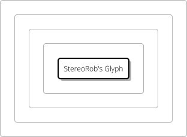
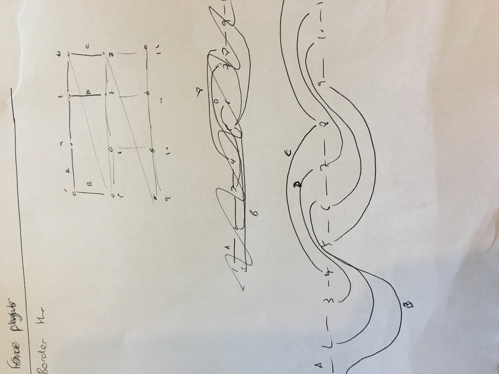
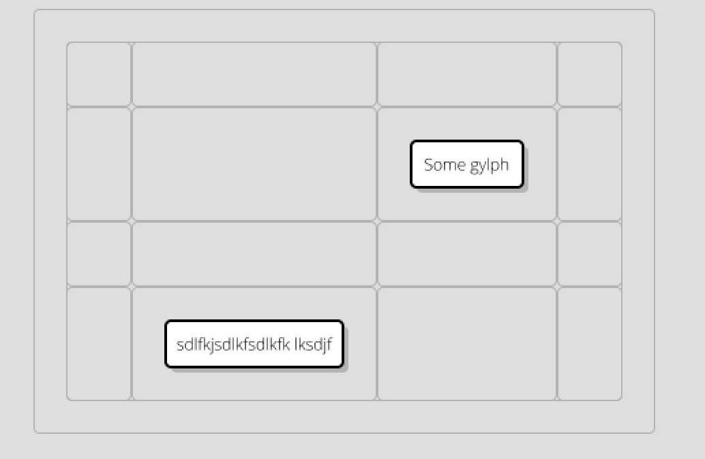

# 8 August 2016 : Sprint 8 - Overhaul Object Model - Containers

- everything should be (`DiagramElement`s) and `Container`s.  Links should be reformatted.    DONE
- Ideally, we are backwards-compatible with what came before.  So, you can load up the original diagram xml  DONE
- Containers are things within DiagramElements.  DONE
- Grid layout for Glyphs (i.e. layout=grid ) 

## Prelude: So, what changes do I need to see:

0.  I need a set of deterministic tests, otherwise, how can I be sure what I am doing?
1.  Everything is `Contained`s and `Containers`.  

## Step 1: Refactoring Containers - Analysis

So, the point is, the `Container`s that are defined on a `ComposedDiagramElement` could contain a single element, or multiple ones.  
(So, I guess this should be another option).  What would happen if I add a second label to a Glyph?  Should it replace the first one, or be added to it?  Isn't this going
to create an over-abundance of containers in the svg?  A lot of the time, you can't even interact with a container, because it's obscured by
something else.  Should it be the case that a container *must have* padding, if it contains more than one thing?  What if it contains *nothing*?  Should 
it still be visible on the diagram?  Maybe there is a way to handle this in the GUI.

The problem is going to be the old XML format:  we have lots of tests just checked in as XML, and I don't see how they
are going to survive this change, although maybe there is a way:  we need to devise some kind of transform that allows
us to convert the whole xml library to the new format.  XLST is the obvious idea, I guess.

Also, we have the issue of tests.  We need to *not break any more of them*, but some are broken already.  So, I am going to 
label the currently-broken tests with `	@Ignore("Broken in sprint 7")`.  The main reason the tests are broken is because of
missing fonts, or the fact that the SVG renderer is no longer working, or something to do with background styles.  All of which are 
acceptable right now.

### Inside/Outside

If we go down the route that a `ComposedDiagramElement` has `Container`s which can have `Contained`s within them, when you planarize a part,
you need to decide what to do with those components:

- If an internal `DiagramElement` has linked `Connected`s, you need to render it using the 'corners' approach, as you need to handle the overlaps.
- If it doesn't, use the 'leaf' approach'.
- (in the future: `Port`s count as `DiagramElement`s).  
- If a part has a component which is a container, you need to render the container with the 'corners' approach too. (if it has contents).

So, we need to have a `PlanarizationMethod` enum:  

|Enum Name | Effect When Applied To Containers| Effect When Applied To ComposedDiagramElements|
|---------------------------------------------------------------------------------------------|
|CORNERS   | 4 vertices, one for each internal corner| 4 vertices, one for each external corner|
|LEAF      | not used                                | 1 vertex.  edge leaving direction not important|
|DERIVE   | no vertices, position derived later| no vertices, position derived later |
|GRID     |not used                                | many, divides up internal containers efficiently|

- `CORNERS` is used when there are interal links, and you care how they leave the current `Container`.  Or if there are multiple connected elements 
inside.  Otherwise, the orthogonalization step won't keep these elements in proximity in the final diagram.
- `LEAF` is where you don't care how the edge leaves the element (there are no further internal edges to consider), so you can put it in the planarization as a single 
vertex. 

These we can figure out later:
   
- `DERIVE` can be used in situations where we don't need to worry about the planarization of the container.  For example, it has a single element inside it,
so the container can be in same place as the contents.  We can derive the size and position of the container just by looking at the stuff inside it.  This can also be 
used for text labels on glyphs:  we can derive them later, and they don't need to be in the orthogonalization.
- 'GRID' is for where we are rendering a grid context, and we need to show the edges, even for empty containers (we'll implment this later)

In the short term (without `DERIVE`, we are going to get an explosion of elements, because every label will get turned into a Vertex (at least this will make it easy
to test).

### Fixing the Inheritance Hierarchy

#### What We have now

Really, it's just too crazy and needs simplifying.  Let's sort this out now:

- `DiagramElement`: The top.  Everything that is drawn should be one of these.  Ideally, they will eventually be immutable. 

- `PositionableDiagramElement`:  This means it has `RenderingInformation`.  Probably not many exceptions to this either.  **REMOVE**

- `CompositionalDiagramElement`:  Means it has a parent.  So, anything that's not a Link. I don't really see the point to this now.  **REMOVE**

- `IdentifiableDiagramElement`: has an ID, so things can reference it.   **REMOVE**

- `Label`: Doesn't really add anything, other than telling you it's not going to have links.   **REMOVE IN FUTURE SPRINT**

- `Connected`: Has Links.

- `Contained`: Part of the hierarchy? Has a container  **REMOVE**

- `Container`:  Has an array for contents, and a layout.

- `Leaf`:  I guess, things that are Contained but not containers.  **REMOVE SOON**

- `ShapedDiagramElement`: Has a shape  **REMOVE**

- `StyledDiagramElement`: `getStyle()`  **REMOVE**

- `TextContainingDiagramElement`:  has `getText()`

- `Leaf` indicates that the element doesn't contain anything with links.  Clearly, Glyph and Arrow (which currently implement this) are
going to be able to have containers, so this needs to go.   **REMOVE**

- `SymbolTarget`: this should be removed. Symbols should be just instances of Parts.  **REMOVE**

- `LinkTerminator`: this really is the end of a Link.  It should replace the 'from' and 'to' in the link.

#### What We Need

Represents everything in the diagram hierarchy, that can be drawn / identified etc.

- `DiagramElement`:  should have `getParent()` and `getID()`, `getStyle()`,  `getShapeName()` and `getRenderingInformation()`.

##### `Connected` vs. `Label` vs `Connection`:

i.e role it has in planarization

- `Connected`: has `getLinks()` and some helper methods.
- `Label`:  definitely *isn't* connected to anything.
- `Connection`: for a connection

##### Things That Can Be `Label`s Or `Connected`s

Broadly, what method is used for deciding the size/shape of the object:

- `Container`: has an array of contents, size of the shape is derived from the contents.
- `FixedSize` or maybe `Shape`:  this includes shapes (e.g. `CompositionalShape`) and symbols.  Has no containers (or any xml content other than class). i.e. a terminal element  (in css, `type: fixed-size`)
- `Text`:  contains text, and must be big enough to hold the text, but can be asked to render into a larger space. `Arrow` could be one of these. i.e. a string. (in css, `type: text`).
- `Decal`: something that overlays a `DiagramElement`, doesn't change shape or size.  Has a fixed position wrt the owner element.  Used for ports.  May only accept at most a single connection on each side.  (We'll sort these out in the next sprint) (in css, `type: decal`)  \

... but these things are really not the classes of diagram elements, merely properties of the way they are drawn:  A `Text` element could have a `Decal`, so
we would need `getContents()` on it.

So, we need to somehow extract this part out, eventually.


##### Other Things That Can Be Drawn

- `LinkEnd`: for the end of a link?
- `Terminator`: for the end of a connection too.

## Step 2: Epiphany

Since the nature of what an element *is* on the diagram is entirely governed by the Stylesheet, we have to make a separation.  Instead of returning *XML* elements, we
need to load up the XML, and then *interpret* the elements, based on what properties they have in the CSS.

This means, we need to divorce `XMLElement` and `DiagramElement` from each other.  Also, we probably shouldn't have setters on the `DiagramElement`s.  So, all the old
stuff like `Glyph` and `Context` will be XMLElements, as will `Diagram`.  There will be a method on `Diagram` called `getContents()` which returns a list of
actual `DiagramElements`, derived from the looking at the styles of the individual objects... and then off we go.  

### Immutability

It would be nice if, from that point on, `DiagramElement`s were immutable.  I don't know if this is achievable.  Let's see how far we can get.  The only problem is likely
to be `RenderingInformation`.  Let's see how this goes, it might be possible somehow.

### `XMLElement`

Now looks like this:

```java
public interface XMLElement extends Element, Iterable<XMLElement> {
	
	public String getID();

	public void setTagName(String tag);
	
	public ADLDocument getOwnerDocument();
	
	public void setOwnerDocument(ADLDocument doc);
	
	public int getChildXMLElementCount();
	
	//public DiagramElement getDiagramElement();

}
```

Where `Element` is the DOM element.   I fixed up the compilation of most of the tests in visualization, so that
we can at least build XML documents using `Glyph`, `Arrow`, `Diagram` etc.   

### `GenericXMLElement`

This now takes the place of `Glyph`, `TextLine` etc, which are all moved into the src/test/java of visualization.
We've completely divorced the XML structure from the rendering approach (for good or ill).  

The good part of this is that we can now use stylesheets to define the behaviour of the elements in the diagram.
This means that Kite9 is getting more "programmable", but the expense is another layer of indirection.

### DiagramElementFactory

This converts from an XML element to a `DiagramElement`, with the new hierarchy defined above.  

### `DiagramElementType`, `EnumManager`, `DiagramElementSizing`

Layout type for Containers is now a *style*, and so we need to be able to return it using Batik's CSSEngine.  For this
reason, I've added `EnumManager`, which converts between a Java enum, and a CSSStyle.  So, when you retrieve the style you 
get an enum.  This is also used for the element type, using the `DiagramElementType` enum:

```java

public enum DiagramElementType {

	DIAGRAM, CONTAINER, TEXT, FIXED_SHAPE, UNSPECIFIED, LINK, LINK_END, NONE, TERMINATOR
}
```

So, the stylesheet is responsible for identifying the `DiagramElementType` used for each XML element, which is then used by the 
`DiagramElementFactory` to construct the correct java object.

Similarly, if the element is `Label` or `Connected`, it will need to be sized, somehow, so this is indicated with `DiagramElementSizing`:

```java

public enum DiagramElementSizing {

	CONTAINER, TEXT, FIXED_SIZE, DECAL, UNSPECIFIED
	
}

```


### Connections

In the `Connection` object, we have `getFrom()` and `getTo()`, which are the only methods which, instead of returning
some nested structural data, are actually returning a reference to a diagram element elsewhere in the XML structure.  Here is the
implementation:

```java

	private XMLElement getToElement() {
		Element toEl = theElement.getProperty("to");
		String reference = toEl.getAttribute("reference");
		ADLDocument owner = theElement.getOwnerDocument();
		XMLElement to = (XMLElement) owner.getChildElementById(owner, reference);
		return to;
	}
	
	private Connected to;

	@Override
	public Connected getTo() {
		return to;
	}
```

So this works fine, using the `getChildElementById()` method on the `DOMDocumentImpl`.  But a `Connected` object has 
the `getLinks()` method, which works in the reverse direction.  From `AbstractConnectedXMLDiagramElement`:

```java
	/**
	 * Call this method prior to using the functionality, so that we can ensure 
	 * all the members are set up correctly.
	 */
	protected void initialize() {
		ADLDocument doc = theElement.getOwnerDocument();
		Collection<XMLElement> references = doc.getReferences(theElement.getID());
		links = new ArrayList<>(references.size());
		for (XMLElement xmlElement : references) {
			DiagramElement de = xmlElement.getDiagramElement();
			if (de instanceof Connection) {
				links.add((Connection) de);
			}
		}
	}
```

So, I added the `getReferences()` method to the ADLDocument class to support this.  


, handled by list in ADLDocument.

-- COnnectionDiagramElement (simple version for now).


### Contained and Connected

Since we have now got rid of `Contained`, `Connected` needs to take it's place in the Planarization.  Since planarization is 
basically all about creating the planar embedding of all the `Connected` objects, this makes sense.

However, we previously defined a `Contained` to have a `getContainer()` method, that returned the container.

Is this always still true, now?

I'm not sure it always is.  Because you could have a port, which is a `Connected`, existing on a glyph, which will be a
`Compound` shape. But right now, this doesn't exist.  So, maybe it's allowed for now.

### Future Of `Container`

How should this work out in the future?  It seems likely that `Container` will disappear from the Planarization code, and 
be replaced with something else (just DiagramElement, I guess).  So, let's make the assumption true for now and then we
can relax it later.  

The entire effort here is just getting rid of `Contained` and getting things working again.

As we go through this, it seems increasingly clear that actually, since a `Container` can have `DiagramElement`s inside it, 
we should be planarizing based on this, rather than on a class.  

Later.

### Summary So Far

This has been a complex set of changes to make.    `Connection` is working, and simple objects can be connected.  However, 
containers are failing right now, as (probably) are terminators, labels and so on.  

How far should we go to fix these things?  This is a really hard thing to judge...  I think we definitely need to see a lot more stuff 
working before we continue refactoring.  

We aren't going to get Glyphs working again without the bit below, so perhaps the only other thing is to fix up `Container`s
properly so that they work.  

### Containers

This actually just fell into place by setting up the stylesheet:

```css
context {
	type: container;
}

It now looks like this:



So, I've added the screenshot to show that actually, things don't look all that great.  But, this is down 
nearly entirely to the stylesheet now, so it's something we should realistically be able to improve.

*However*, doing so would be a waste of time, as later on we are going to convert output entirely to SVG.  
So, it would be almost wasted effort to do so.  

### Labels

Before I go on, let's just think about this:   `Label`s need to *not have* connections.  So, they 
are clearly different from `Text` or `Container`.  But, we do want labels to have complex, content.  

This is a problem, because we want to be able to re-use our content structures.  e.g. *composed* labels 
should be allowed.

So, either we have to:

- Have a separate set of classes for label, so that we can ensure we don't accidentally try to connect to them
- Do some kind of special hierarchy tests with labels.  
- Have both composed / non-composed
- Have a flag to say when an element is a connection.

This all sounds slightly complex.  First, how do we identify a label?  Clearly, the stylesheet indicates it.  Then, 
we know we have one.  So, it's easy to identify a label.  

*I like* having a class, which tells me which elements are `Connected`.  This gives us much more type-safety.

So, this means that when we create labels, we have to do something special. either something is `Connected`, or 
it's a `Label` (see above).

The problem is, our class hierarchy and `DiagramElementFactory` don't really represent this yet.   

So, I have reverted for now to text-only labels.  These work fine.  We need to allow labels to express the
`sizing` css directive, like `connected` elements do.

### Hinting

I've spent a bunch of time fixing up the tests after this refactoring.  Obviously, Glyph layout is
broken, so that doesn't help. 

But, only `Test45Hinting` is broken: hints can't be written as the XML is fairly immutable now.  
I've @Ignored this, and commented out the hinting code, it needs rethinking.

Really, Hints should re-order the container contents, and then we should as far as possible respect the container ordering when we 
render, unless a better option comes along.  

Also, ports should allow people much more control over the positioning of links, which will help.

So, this needs some more thought:  the ordering in the diagram should affect the original XML that is going to get writen out, 
leaving our main `DiagramElement` layer immutable.

## Step 2: Containerizing Glyphs / CSS For Layout

### Grid CSS

Let's have a simple grid layout, where elements in the grid occupy one or more squares of the grid.  You define how big the 
grid is going to be using css up-front:

```css

glyph.full-spec {
	type: composed;
	layout: grid
	grid-size: 3 4							// defines a 4x4 grid, from x1-x4 and y1-y4
	
	path: M x0 y0 H xe V y3 H x0 z;			// basically a rectangle. xs is an alias for x0 and xe is an alias for whatever the last one is (y3 in this case)
	padding: 6px 6px 6px 6px;				// leaves padding around the rectangle 
}

glyph stereotype {
	type: text;								// defines a label
	layout: right;
	occupies-x: 0 1;						// might be a better way to define position than the single 'occupies'
	occupies-y: 0 1;					
}

glyph symbols {
	type: container;
	layout: right;
	occupies: 1 0 2 0;
}

glyph label {
	type: text;
	layout: center;
	occupies: 0 1 2 2;
}

glyph body {
	type: container;
	layout: down;
	occupies: xs y2 xe ye; 
}

```

Notably, we are not worrying about minimum sizes of grid squares, or ordering of elements in the grid.  Or making sure certain parts of the grid
are occupied. 

It's assumed that the grid will be an actual grid and not flex around in any crazy way.  (This simplifies definition)

So within a particular `type`, we can have various `layout`s.  Obviously, this makes things more complicated, because certain types won't afford
certain layouts.  e.g. layout center is not going to work for a container (I would think).  *Unless* we have horizontal and vertical layout options.  
Which might be a good idea.  

Ideally, we should *not* be binding these concepts together.  `layout` and `type` and some grid size detail, and maybe other things.  But maybe, for both 
a container and a glyph, the concept of `layout` is separate from the concept of `type`:   although glyph elements are *named* whereas container elements are
*a list*, they should both be able to define their `occupies` or `x-position` values.

So... 

All we really need to do is to create a container with a grid, right?  

### Changing RHDPlanarizationBuilder

The first step is to introduce the idea of 'GRID' layout to the `GroupPhase`.  This was pretty simple, and is encapuslated into `GridHelp` class.  
Grids are trivial to group (almost not worth bothering... maybe remove later?).  So, implementing this was fine.

### Building A Test

Added `Test51Grid`.

### Subdividing Integer Ranges

This is turning out to be a problem in more than one place: we have a range (0-1 or 0-1000, say), and we want to be able to fit stuff inside this hierarchically, 
and get a position back.  Problem is, we can't use `float`, `double`, `int` or whatever, as they have bounds on their precision.  What we need is some kind of thing
called a `Subdivision`, which we can divide as many times as we like.  

Also, somehow, this should represent 'space' in a meaningful way.  In the end, I decided to use `BigFraction`.  This has arbitrary precision, but at the same time is 
very meaningful at the lower levels (1/2, 0, 1 etc)

### Container Vertices

One problem which already exists in Kite9, is that we like to give container's vertices a bit of "border" away from their contents.  This makes it much easier to do positioning correctly.   
However, it's a problem because all the careful work we do in the gridding phase to line everything up is irrelevant when we use fractions to reposition everything.

If we have a glyph placed above a container at 0-.5, and then a glyph *inside* the container below it placed at 0.12-0.5, then there is a bias occurring, and this 
will increase the more we nest containers. 

So, the solution to this is to make the fractional change *very small* between the container and it's border.  But, the smaller you make it, the larger the fractions 
grow and the sooner you run out of capacity in `double`.  (And the quicker `BigFraction`s will get bigger.)

So, this is not really a solution *at all*:  Kite9 is guaranteed, at some depth to run out of precision just using a double.  And, it has a fixed padding size, 
which again, will eventually mis-align with the parent.  

To fix this, we should determine the size of the padding algorithmically, based on the smallest grid in the layout.  And, by using BigFraction, when we divide the space up asymptotically, 
we will never run out of space, but, the more nesting we have, the more the fractions will grow.  However, we will have made it so that:

- Leaf elements are always aligned, irrespective of container depth
- There is always space for more containers
- We lose the need to have crazy small fractions mostly, unless diagrams get really big.

So, this sounds like a big win.

We know that around each glyph, we would have some space to play in.  We can use the container depth to work out 
how close to the glyph the vertices go:

```
pos = buffer / (depth+1)
```

We should *ignore* grid-containers when working this out:  all the containers within a grid should basically be the same depth.

Another factor here is that we would need to work out the size of the smallest grid-square (both dimensions, individually).  Once this is done, we can use this 
to size our `buffer`.

Because this is implicated in gridding, is it something we need to fix now?  Arguably, yes, because it will make reading the positioning diagram much easier.
So, I fixed that up, which means that container border vertices are always based on the size of the smallest grid square.

### ContainerBorderEdge

Having constructed all of the vertices, and made sure we are re-using them where possible for multiple sub-containers (or whatever), we now need to join them
up.  

The first problem here is that now, an `Edge` can potentially have more than one different underlying element, and we have *a lot* of code that looks at the `getUnderlyingElement()`
method.

To fix this, we are going to use the outer-most container as the underlying `DiagramElement`, then we can add some extra methods to `ContainerBorderEdge` to give you back what you need:

```java

public class ContainerBorderEdge extends AbstractPlanarizationEdge {

	Container cide;
	Collection<DiagramElement> containers;
	String label;
	
	public ContainerBorderEdge(Vertex from, Vertex to, String label, Direction d, boolean reversed, Container cide, Collection<DiagramElement> containers) {
		super(from, to, null, null, null, null, null);
		this.cide = cide;
		this.label = label;
		this.drawDirection = d;
		this.reversed = reversed;
		this.containers = containers;
	}
	
	public ContainerBorderEdge(ContainerVertex from, ContainerVertex to, String label, Direction d) {
		this(from, to, label, d, false, getOuterContainer(from, to), new HashSet<>());
	}
```

As we define `ContainerBorderEdge`s, we need to give it the information about which (two) containers it borders.  Also, it knows what the lowest-level, outer container is.  
This works well, and labels are correctly placed for the inner containers.  

Having done this part, `test_51_1_SimpleGrid` is now correctly rendering!. So, we are making great progress here.


### `test_51_3_GridWithMissingBits`

This test complicates matters by introducing a missing square and labels.  The missing square gets completely ignored in the vertex placement process.  This is 
because we don't change the contents of the container to add the new, "virtual" container.    We *can* add it in, but this is going to break the rule
of immutability.  But, I'm going to do that for now.  

### `test_51_4_Supergrid`

This is just really the same as `test_51_3_GridWithMissingBits` but actually, it didn't just work.  For some reason, the edges of the grid get directed all around in the 
wrong directions.  This seems to be largely to do with the fact that the `ContainerEdgeRouter` was written at a time where we allowed container edges to bend.

However, now, they don't bend:  they are always straight lines between the corners.  This actually simplifies *a lot* container edge routing:  during this phase, 
there will be no crossing over other container edges, and there will only ever be under/over links, as this diagram shows:



For this reason, it seems a good idea to rewrite a lot of the router, to minimise the number of things it considers.  Actually, this was pretty simple,
and just involved changing some of the methods in `ContainerEdgeRouteFinder`.  

So, this test works fine so long as the containers have labels.  When they don't the containers within the grid don't get sized properly (it seems like the
edges don't even get separated from each other).  

#### Segments

After this, (and some fixes to labelling) the test worked, but we have a situation where now `Segment` only has a single underlying element, but we actually need 
it to handle more than one (maybe):

```
SEGB Segment: 1 has underlying [diagram:'diagram':DiagramImpl] on side LEFT
SEGB Segment: 2 has underlying [diagram:'diagram':DiagramImpl] on side RIGHT
SEGB Segment: 3 has underlying org.kite9.diagram.visualization.planarization.grid.GridTemporaryConnected@9bab6d37 on side LEFT
SEGB Segment: 4 has underlying tl-|-tr on side null
SEGB Segment: 5 has underlying [context:'br':ContainerImpl] on side RIGHT
```

In this, we have incorrectly identified segment 3 as having a `GridTemporaryConnected` as it's underlying, so padding is broken.  (Fixed).  The
correct underlying should be the grid container itself.  Segment 4 is also suspect, because it's using a temporary element too. (Fixed).

So, now, we get this:




### Modifying The Diagram

When we lay out the diagram and it has horiz/vertical components, and they move, we change the *actual XML of the diagram*.  I don't think this really 
happens anywhere else.  Perhaps we should *stop* doing this for now, and treat the diagrams as immutable again?
 
### Improving Tests

Having refactored all the XML like this, there should be a better way (now) to check that the `DiagramElement` structure
matches up with the XML structure, and that everything is rendered.

TBC


### Shortcut attributes vs styles.

### Removing the `@Ignore`s.

We added a whole load of these in Sprint7, to cover Keys, and complex Glyphs.  They need to now be removed.


# Some Gridding Issues

This doesn't really solve the crazy-paving problem.  Might need more thought, or it might manifest anyway in 51_5.
