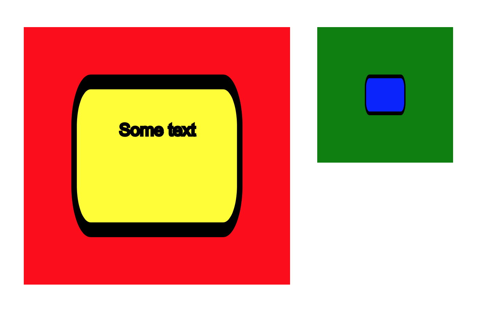

# 18 January 2017 - Sprint 011:  SVG As The Output Format

- Split tests into planarization, orth, compaction, display so we can add SVG to the display ones only.  DONE
- Update test results to check SVG, where necessary.  Don't use this for all tests, just some.
- this means converting our displayers to use SVG rather than Graphics2D.    
- Test against SVG content, make sure it's deterministic.   
- In order that we can properly take advantage of fills, we need to start using SVG as the output format.
- "Common" section of the diagram, containing things to reference.
- Better to get this out of the way early.


## Prelude

Ok, so we have an element (say a `Text` `DiagramElement`) which we want to render.   This will be turned into
SVG by applying the stylesheet, and rendering it into a number of elements in a number of layers.

A single diagram element can turn into multiple SVG elements.  So, we should hold them together 
with a group.  (We already do this, really)

And, the groups should be further layered to enforce drawing order.

Finally, we will have the special "flannel" layer and "container" layers, which will provide 
drop-containers and interactivity.  

*Any* SVG CSS will be allowed to be applied, so, this means animations will work, background images, etc.

So, we need to cover off a lot of that in the tests.

Also, we are going to need a "common" area of the diagram, where we can define fill patterns and so on.  
This is a key part of SVG.

## Palettes

From the point of view of a palette, it seems really cool to pull a  load of XML out of one document (i.e the palette)
 and stick it into another and off we go.

However, in practice, this obviously won't work, unless the representations are completely the same, or at least, reversible.

*Can we create an augmented SVG, that allows us to drop from one place into another?*

Answer: no.  The output from rendering *is just different*.  You've got layers, etc.  Isn't this going to
make it really hard to work with palettes?  Yes.   Well.   Maybe.

I guess the way a palette works is that you drop an element from one place into another.    So, when we add
a palette into a diagram, we are basically adding a bunch of `defs`.  These `defs` get copied across to the diagram.


## `use`

SVG already provides facilities for this, via the `<use>` tag.  Out of the box, we wouldn't support this. 

- **A palette is an XML file**, an output format that we produced, that can be shown on the screen.
- **There should also be a stylesheet**:  A stylesheet can define some `<defs>` somehow, which are used by the palette? 
- When you copy a bunch of XML onto your document, defined as SVG, can you edit it?   The obvious answer is
no:  it's static SVG.  We're not building an SVG editor after all. 
- But, we're kind of headed this way:  we have colour-pickers, we want to be able to upload background images.  Where 
will it end?

## Containment

Our own XML specifies the container hierarchy.  This is a big part of knowing what to render.  However, when we convert to 
SVG, this is always lost.  Also, you can't (I think) support both containment and animation, so obviously containment has to go.

But, well we need to have this specified in the diagram, otherwise copying and moving won't work, so I think the `flannel` layer
(which should be called `control`) will manage this... somehow. (maybe we'll have some extra tags or attributes to do this?).

In fact, I think maybe the control layer should contain the snippet of the original XML that represents the shape from the 
original diagram.  That way, we can reconstruct the original XML when we do the palette copy.

So, the control layer is for behaviours (`onclick`, `mouseover` etc) as well as important meta-data about the structure of the diagram.

## Text

Take this example diagram:

```xml
<?xml version="1.0" encoding="UTF-8"?>
<diagram xmlns="http://www.kite9.org/schema/adl" id="The Diagram">
  <arrow id="One" rank="0">
    <label id="auto:0">One</label>
  </arrow>
  <arrow id="Two" rank="1">
    <label id="auto:1">Two</label>
  </arrow>
</diagram>
```

We're now at the stage where we need to consider the label and the arrow as separate parts.  Currently, our displayer is treating both at the same
time.  We shouldn't do this anymore.  

But, how to achieve this?
- Often, displayers are asked to size up their content.  This is ok where we know exactly what the content is, and this is what we've relied on in the past.
- Containers also have the problem of working out their sizes.  Most of what we are doing seems to be moving things in the direction of being more like containers. 
- Sizing is only used in 3 places:
	- `LabelInsertionOptimisationStep` (for working out the size of a label)
	- `BasicVertexArranger` For setting the sizes of the darts around a vertex.  Happens after orthogonalization.
	- `VertexArrangementOrthogonalizationDecorator`: Which basically calls the above.

So, it seems like we need to do some work on deciding what to represent in the diagram, and how to represent it, post orthogonalization.


# Step 1: Displayers

We need to refactor displayers so that we have an ordered list of layers, and each displayer knows how
to draw a layer (or layers?).  

We have the following layers:

```java

public enum GraphicsLayerName {

	BACKGROUND, SHADOW, MAIN, FLANNEL, WATERMARK, COPYRIGHT, DEBUG
}
```

We at minimum need to create a `text`-element displayer which handles:
- the `shadow` layer
- the `main` layer
- the `flannel` layer

And, for the `diagram` element, we need to handle `background`, `watermark`, `copyright` layers.

As a test, we should be testing the *actual content of the SVG diagram*.

# Step 2:  Random SVG

[This page](https://developer.mozilla.org/en-US/docs/Web/SVG/Element) covers details about all of the different SVG elements.  

Now, since we are using CSS attributes to determine content, it seems perfectly reasonable that we will be able to nest any of this stuff within
one of our elements.  

It would be nice if we had a component that was a container for SVG. i.e:
- It has a minimum size
- It's rendered in SVG as a group
- Within the XML, it contains some SVG instructions, which get piped into the output.
- Potentially, maybe we can expand the size of the group later. 

This would be useful for things like the background image, and also the horizontal line (or any other fixed shapes
that we want to output- ports, perhaps).

Later, we might be able to extend this to cover terminator shapes.  For now, I think it's enough to just create one.

In order to do this, we need a way to pipe SVG into the output of the diagram.  And, we need to be able to specify
that certain XML elements are just "straight" SVG.  

**How can this work?**  I am guessing one of two ways:

## Can we simply pass SVG straight through to the output context, unmodified.  (as XML)?

So, once we have *interpreted* the input XML, and attached CSS styles to it, are we in a position to simply transform that into SVG?  If it's *already SVG*, then,
we are done.  (We would need to "flatten" the styles in order to get rid of the need for the CSS stylesheet... hmmm.)  Alternatively, we could translate the stylesheet 
so that it's also available on the client side.  This wouldn't be a total disaster if we used classes.

*Can the path be a CSS attribute?*  No.  

## We could interpret the SVG using Batik, and then output it to the graphics context, to be converted back to SVG.

Let's discuss which is best.  The first way is probably less of a problem.  However, transforms probably *are* going to be needed:  you might need to move an
element, or apply some stylesheet settings.   (Are we going to have the stylesheet set for the client elements?  Surely, we are using the stylesheet to transform
the *input*, not the *output*.   The output is the result... 

Ok. In that case, we are going to need to interpret the SVG into (whatever it should be) and then output it.  Is that even going to work? 

Probably not.

## Transforms

We need 3 transforms (i.e displayers):  

1.  Has some text in it, and can work out the size of itself based on the text, and turn that into some SVG `<text>` tags (within a group at a specific position on scree).
2.  A fixed-size shape.  Turns this fixed-size shape into some SVG on screen (SVG is passed through from the contents of it). 
3.  A (decorated) flexible shape.  For a given size, creates an SVG `<path>` element in a number of diagram layers.  Paths all have `d=` attributes.

## Building Tests

1.  We need a test of an element that contains an embedded piece of SVG.  DONE
2.  We need to see if we can add all the random SVG things to one of our existing elements (background, other CSS etc).
3.  Can we embed some *styled* text within a glyph, and get it sized correctly?

## How Much Batik?

 - We need Batik to interpret the DOM and create our Stylesheets.  That's great.
 - The next thing Batik does, is create a `BridgeContext`.  From this, it converts the DOM into `GraphicsNode`s.  (Each bridge function handles a different element).
 - Each graphics node *knows how to display itself*.  That is, *paint* to the Graphics2D output.
 - Additionally, Batik contains a Graphics2D implementation which can itself output SVG.

### Question 1:  Are our elements merely new XML elements?  If they are, we could supply some new `BridgeContext`s in order to display them.  Is this a good idea?

Ok, let's think about that.  Firstly, it means that all Kite9 diagram elements would essentially be the same (they already are, anyway).  So, we would be defining
a new namespace which exists within Batik's SVG one.  (Er, we already have).

We could then register a Bridge Context which takes *my* elements and then runs the whole Kite9 process over them.  If we did this, what would we gain?  \
 - First, all the normal rules of SVG would be upheld (transparency, etc).  
 - Second, we could plug into the normal SVG pipeline nicely.
 - We'd only need to write a couple of BridgeContexts, and everything would display nicely.
 - BridgeContexts would, however, need to be happy with multiple layers.  (These are handled I guess by `GraphicsNode`s).
 - So, each of my `DiagramElement`s would have a BridgeContext...  
 - Generally, it would be easy to determine where they would be, and create the layout.  Would the outline of a glyph actually just be a correctly scaled path?
 - All external resources would be flowing through the `UserAgent` abstraction.
 - Kite9 elements would be able to contain SVG elements.  But not vice-versa (for now).
 - Luckily, we are able to get the `DiagramElement` for a given `XMLElement`...
 
### Question 2:  How to extend the Bridge Context?  

 - I've seen this documented on the internet.
  
### Question 3:  Ok, how to proceed, then?

 - We start with the diagram element - you have to have that for Kite9 processing.   (Step 1).  
 - Each diagram gets processed by the appropriate bridge element (`Kite9Bridge`)
 - We create some separate classes for this:  let's try to set up the Batik context to output diagram elements (as groups).
 - So, we're going to transform the way the new primitives tests work.
 - We *don't* add processing of text - we just work out how big the contents are and display them inside the group.
 - `Renderer` class is the base class for rendering a GVT tree into an output.  
 - `SVGAbstractTranscoder` takes an `SVGOMDocument` and creates a `BridgeContext` with it.
 - It creates a `GVTBuilder` and calls `builder.build(ctx, svgDoc);`
 - Then, calls Renderer.setTree or something to set the GVT Tree on the renderer.
 - `Renderer.repaint` to output it... `renderer.getOffScreen()` to get result.
 
First, I created `test_54_3_TestTranscoder`, which demonstrates Batik converting a simple SVG document into PNG.
Now, can I get it to recognise Kite9 elements inside that?  Problem here is that a lot of the Batik code doesn't
have rendering anything other than SVG in mind.  

This means that I need to extend their elements a lot of the time, which is tricky:  I already have my own inheritance
hierarchy, which doesn't include `SVGSVGElement`.  I've constructed a `Kite9BridgeContext`, which is basically
used for 'driving' the conversion process between the XML DOM and the Batik `GraphicsNode`s.  

However, what immediately becomes obvious is that if I want my XML elements to play nice with Batik's approach to 
rendering, the whole DOM is going to have to implement the right interfaces, and currently this doesn't happen.

For the purposes of Kite9, our elements are *new classes within the hierarchy of SVG*, and so should implement the 
expected SVG interfaces.    (Done)

Second, my Kite9 `<diagram>` element really should extend their `<svg>` element - can we achieve this?  If so, we 
can render the initial diagram without writing anything in the way of new code.  Then, what's next?   All of the other Kite9
elements should (by default, I guess) extend out the SVG `<g>` element, since they all need to make (at least one) group.

Let's consider an alternative, quickly:   what if my <diagram> element could be nested *inside* the SVG element?
 - This would be good from the point of view that, the SVG element is really a placeholder for some SVG, and has no content,
 whereas a diagram is actually something that exists within an SVG document.
 - Also, from the point of view of being more Batik-y, and closer to what they expect the extension points to be.
 
### Integrating Further

I have some tests working: I can now take *my* Kite9 SVG elements and get Batik to output them.  That's a start.  Next, I need to 
be able to handle Batik having *nested* SVG elements within mine:   if I can get that working, then it's really only one step from 
there where I can say:  set the size of my SVG element to contain the Batik ones.

This pushes me towards the belief that most of my elements will be groups:  I can position them wherever on the page.  But, maybe that's
just the starting point.  I should be looking at shapes too, embedded within them?

# Step 3:  Scaling Containers

In order to check that elements are sized correctly, with SVG contents, we need to be able to see them a bit better.
For this, we're going to need to create borders.

## Problem

At the moment, we can run `size` in the displayer, and work out how big a container is, based on it's contents.  This is a 
problem if the contents *themselves* depend on the size of the container.  So, we need to be specific about this:  either, you're 
`StaticSVG`, and you can be sized, or you are a `Container`, and your size is dependent on contents.   

So, let's create the static SVG element right now so we can move beyond that problem.  (Creates `FixedSizeGraphics`)

## Scaling Containers

So, let's say the container has some SVG inside it.  Really, we want this to scale to be the same size as the container itself.
The obvious way to do this is to put a transform on the group element for both position and size (unlike `FixedSizeGraphics`, which 
we just transform position).  This introduces a second problem: transformations compound on each other.  So, we can't respect the 
containment ordering of groups the way they are represented in SVG.  

There are two ways around this:

1.  Use two SVG groups per ADL element:  one to contain the ADL structure, one to contain SVG.  Only the nested SVG one would have
a transform.   This is kind of OK, because you would be positioning elements correctly, but there would be twice the number of
groups that you need.  

2.  Do what we do in the diagram editor at the moment, and flatten the structure.  ADL elements are *not* nested in SVG groups, 
they are ordered according to depth within a single group.  This reduces the number of groups, and has been proven to work, so this 
is what we should do, however, we lose the information about the structure of the diagram itself.

The only problem with (2) is that we have to now interrupt the logic of the `GVTBuilder` component.  So, maybe we should try (1)?
Thinking ahead a bit further, we are going to run into `GraphicsLayer`s, soon, how does this affect things?  For the diagram, we are going
to want to construct a number of layers, and then populate them.  I have a feeling this will mean changing the `GVTBuilder` too.

Looking at the code of `SVGAbstractTranscoder`, it doesn't appear that there's any way I can really change `GVTBuilder`.  Is there an 
alternative to doing this?

One approach is to avoid the use of `isComposite()`, which handles the construction of the tree based on the group structure.  If my 
bridge elements actually set `isComposite()` to false, we would end up creating the group structure ourselves.

## Identifying Groups

If we want to do (1) or (2) above, then we need to be able to indentify groups properly after the transform.  The only problem is that 
`SVGGraphics2D` (which we are using to output our SVG) doesn't *directly* support a "createGroup" method or anything:  instead, groups are
constructed *as needed* by `DOMGroupManager` and `DOMTreeManager`.   By "as needed", what I mean is that as you construct SVG primitives in the
DOM, it tries to preseve as many attributes as possible from one SVG element to the next, by the use of groups. 

This means (I think) that there will only really be *two layers* of groups. The `DOMTreeManager` manages the `topLevelGroup`, while the `DOMGroupManager`s
manage a procession of sub-level groups, changing groups when they determine that enough of the attributes have changed between elements.
 
However.  We need to change this approach so that we have multiple top-level groups:  one for each of the Kite9 diagram elements.  I *think* this 
really means we have to mess hard with the `DOMTreeManager`, and keep changing the top-level group within it.  

We kind of did this before for `SVGRenderer`, so let's do it again here, with a simple `Deque`, in `GroupManagingSVGGraphics2D`:

```java
public class GroupManagingSVGGraphics2D extends SVGGraphics2D implements GroupManagement {

	private Element realTopLevelGroup;
	private Element currentSubgroup;

	@Override
	public void createGroup(String id) {
		Element newGroup = currentSubgroup.getOwnerDocument().createElement("g");
		currentSubgroup.appendChild(newGroup);
		newGroup.setAttribute("id", id);
		this.currentSubgroup = newGroup;
		setTopLevelGroup(newGroup);
	}
	
	public void finishGroup(String id) {
		if (!id.equals(currentSubgroup.getAttribute("id"))) {
			throw new Kite9ProcessingException("Was expecting current group with id: "+id);
		}
		
		Element parent = (Element) currentSubgroup.getParentNode();
		setTopLevelGroup(parent);
		this.currentSubgroup = parent;
	}
```

## Getting the Translation Right

First thing I notice is that if I scale an element, it also scales the stroke-width.  So, it seems like scaling is out, right?
What should I do instead?  Well, the other options are (I guess) more complex:  I can either scale the stroke back down (seems like
an easy out) but even then the radii on the borders are wrong.... 

So, it seems like we need something *cleverer*.  Values (sizes, positions) on the SVG elements are set up and held in `SVGLength` objects and the like,
which are returned from the classes like `SVGOMRectElement`.  In practice, Batik handles these with base classes and 'animated' subclasses.

These object implementations know how to retrieve the values from the underlying XML document using the `revalidate()` method.  But actually, there are (probably)
lots of cases where we *will* want the whole background to scale with the size of the cell, so I am thinking really that what we need is a special version of SVGPath
that knows about it's container (the original idea).

So, let's just focus on fixing the translation first.  Unfortunately, this is complicated by needing to understand the bounds of the contents: with Kite9 elements 
involved, it's pretty much impossible to know what the contents' bounds are.  Maybe we need to change CompositeGraphicsNode to ignore Kite9 elements?

*You can't reliably give the bounds for an element when it has unsized sub-elements within it*.  So, I had to add some functionality for 
sizing *just the SVG*, which allows me to work with fixed bounds.  This is in `IdentifiableGraphicsNode.getSVGBounds()`.

Having figured that out, the next challenge was that the affine transforms are compounded in graphics nodes.  I had to keep this in mind when setting
up the transforms for nested elements.  However, eventually I was able to create the below:



In this, we have multiple nested elements (and text), which are scaled according to affine transforms on the various groups.

# Step 4: Proper Paths

From [Sprint 8](sprint_008.md) we have the following definition for grids:

```css
glyph.full-spec {
	type: composed;
	layout: grid;
	grid-size: 3 4;							// defines a 4x4 grid, from x1-x4 and y1-y4
	
	path: M x0 y0 H xe V y3 H x0 z;			// basically a rectangle. xs is an alias for x0 and xe is an alias for whatever the last one is (y3 in this case)
	padding: 6px 6px 6px 6px;				// leaves padding around the rectangle 
}

glyph stereotype {
	type: text;								// defines a label
	layout: right;
	occupies-x: 0 1;						// might be a better way to define position than the single 'occupies'
	occupies-y: 0 1;					
}
```

Where, we can define a path based on the shape of the grid.  That's cool, but we don't even need to go that far.  We could define a path based on just the size of
the stereotype.  The path may be related to the padding (we have minimum size padding, but layout may increase the padding to accommodate arriving connections).  Or, the 
path might be related to just the text within the text area.  Also, we have a margin which surrounds this, which the path might stray into, reasonably.  

What is the difference between the padding and the margin, then?  Padding is putatively "within" the shape, and connections meet up to it.  But, margin is the distance 
between other elements, and while margin might be a minimum distance from the another element on the diagram, it doesn't mean that you "own" this space, so 
anyone overlapping into it might end up overlapping with something else.

## Point Transformations

As well as paths (which are in SVG specified using d=""), we could also perform transformations on points:

```xml
<line x1="20" y1="100" x2="100" y2="20"
      stroke-width="2" stroke="black"/>
```

or 

```xml
  <polygon points="60,20 100,40 100,80 60,100 20,80 20,40"/>
```

Remember, groups will help us do simple translations, but if we want to scale to the size of the container, or to particular grid positions, we'll have to do
something cleverer.

One problem with this is that we will struggle to load the code in using Batik, I would think?  It's going to hate parsing CSS entities if they contain weird 
syntax.  

# Step 4: Managing Transitions

One problem we are going to face is that we need to transition between old and new versions of an SVG diagram.
This is going to be tricky.  We need to make sure:

- We have IDs on all the elements
- We use translations
- We use groups correctly, so each element has a group, which we can move around.  

(I think we now achieve this, but we'll find out later if it all works)


# Step 5: Definitions

In SVG, it's possible to define a filter or texture in one place, and then re-use it across the whole diagram.  If we import an element using a palette
then it's important we also bring in the `defs` from it.  

- rename XMLElement to Kite9XMLElement


