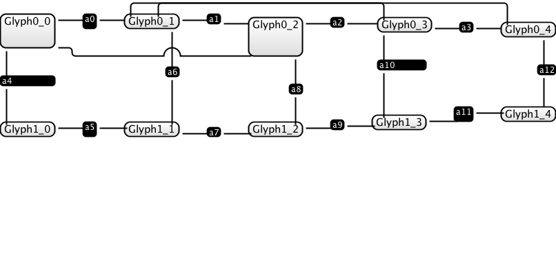

### Labels

These are broken at the moment, for a number of reasons:

- First, I don't think we're actually making a serious effort to lay them out- so, we can get that going for starters
- We need to be able to do left/right/top/bottom alignment, and set padding accordingly.  For this reason, it feels like labels are actually containers of a sort.
- Clearly, they are also rectangular.
- We need to be able to calculate the space used by a grid (for Glyphs and Labels), so we can set the dart sizes for it.  This might be tricky.
- i.e. we need a way to effectively calculate the size of a container / rectangle properly.
- BUT, if this container has links within it, you're not going to be able to do this properly.. it calls for bottom-up rectangularization in combination with compaction.

Can we compact from the bottom up?  We could do this per-outer-face.  Because, any time you get an outer face, you're looking at nesting it within something entirely.

So, compaction should be done on a per-outer-face basis.   And, the first part of any compaction is to resolve the faces within it.  

1.  I could just simplify for now:  labels become FIXED, and just occupy some space.  But, keys would be broken.  (Let's just remove labels for now)
2.  I could refactor, and make it wor

### Outer Dart Positioning

This allows me to see things like this:

We're going to fix them later in the "Fixing Dart Length Section"

First, connections aren't centered on a side.  This is because *we don't really know the length of the sides now*.  Because we are using labels, 
and groups, we don't really "roll up" the glyph sizes like we used to.  This needs to be fixed where possible, although I'm kind of unsure how. 
It should be possible to Rectangularize from the bottom up, so we work out the sizes of the embedded elements, so that we can position in the 
middle again.  

Second, because we don't know side-lengths, the rectangularization is off on elements like a4.  I think this is part of the same problem.

Third, we don't have any snap-to-grid functionality, and because of this, the position of nearly everything is off.

(TO BE COMPLETED)