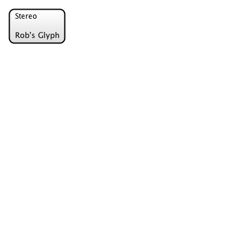

# 21st September 2017: Sprint 16: Looks

- Fonts
- Images
- Patterns
- Add shadows in
- Complete work on the designer stylesheet so we can display everything in high fidelity.
- Control Layer
- Container Corners

# 1. Fonts

We need to be able to specify the font in the stylesheet, and for it to show up *in the test results*.  
This should work pretty much ok with the @font-face:

```css

@font-face {
	font-family: "opensans-light-webfont";
	src: url('../fonts/opensans-light-webfont.ttf') format('truetype');
}
```

Here's the resulting PNG:



So, the font gets rendered correctly, but *this isn't my font*.  This is some Batik-defined system font.
Other people also seem to have this problem in StackOverflow.

- Fonts are correctly loaded into memory
- They are processed by the TextBridge
- They are added to the TextNode instances
- Then, StrokingTextPainter is used.  

So, there are two problems:

1.  Location of the font isn't worked out correctly.  e.g. I am using relative paths, and that's a no, since (I guess maybe) there's no baseURL for the document.
2.  We are overriding the TextLayoutFactory so that we're *not* turning every single character into SVG.  

Once we extract out these two things, stuff works perfectly (so that's nice). 

Issue 2 - is this a non-issue?  If we are rendering PNG/PDF, then we can *of course* use Glyphs to convert.  When we are rendering to SVG it's a different matter, 
but in actual fact, we're not really interested in exact rendering when this happens anyway.  This might be something to leave to tomorrow, now.

## Fonts in SVG / Batik

`Graphics2D` uses the Java `Font` class, which doesn't match SVG.  

- SVG manages all fonts either through built-in fonts, (Verdana, Arial etc), or using `@font-face` (`GVTFontFace` in Batik) 
- All are specified using `font-family` in CSS or as an SVG attribute. (`GVTFontFamily` in Batik).
- From the `GVTFontFamily`, you can `derive` a `GVTFont` instance, in a particular size, etc.  
- There are two GVTFont implementations: AWTGVTFont, and SVGGVTFont.  
- SVGGraphics2D uses the underlying `Font` object, because this is what Java uses.

## Outputting `@font-face`

We've already extended `SVGGraphics2D` to allow for groups, but no we also want to be able to add `<style>` information.  So, generalizing:

```java
/**
 * Marker interface for a `Graphics2D` implementation, to say we are outputting to an SVG file.
 * 
 * Allows creation of named groups and also transcribing XML content into the output.
 */
public interface ExtendedSVG {

	/**
	 * Starts a group within the svg output file.
	 */
	public void createGroup(String id);
	
	/**
	 * Finishes a group.
	 */
	public void finishGroup(String id);
	
	/**
	 * Returns a Java2D font which has a font-family which is resolveable.
	 * Also ensures that the correct @font-face is described in the output SVG.
	 */
	Font handleGVTFontFamilies(List<GVTFontFamily> families);
	
	/**
	 * Adds a font-face to the output.
	 */
	public void addFontFace(GVTFontFace face);
	
	
}

```

Now, when we see an instance of `ExtendedSVG`, we know we are outputting to an SVG document, and we need to add the groups and font faces. 
The rest of the work can happen inside my subclass of `SVGGraphics2D` and inside the `TextBridge`.  All the `TextBridge` needs to do is:

- Ensure that we are outputting as text, rather than vectorized glyphs (we did this already)
- Ensure that the `font-family` is set correctly when we output.
- Ensure the `@font-face` declarations for these families are available in the output document.

The `TextBridge` code to do this goes like this:

```java

	@Override
		public TextSpanLayout createTextLayout(AttributedCharacterIterator aci, int[] charMap, Point2D offset, FontRenderContext frc) {
			return new FlowGlyphLayout(aci, charMap, offset, frc) {

				@Override
				public void draw(Graphics2D g2d) {
					if (g2d instanceof ExtendedSVG) {
						ExtendedSVGGraphics2D eSVG = (ExtendedSVGGraphics2D) g2d;
						...
						
						@SuppressWarnings("unchecked")
						List<GVTFontFamily> gvtFontFamilies = (List<GVTFontFamily>) aci.getAttribute(GVT_FONT_FAMILIES);

				        if (tpi == null) return;
				        if (!tpi.visible) return;

				        Paint  fillPaint   = tpi.fillPaint;
				        
				        
				        if (fillPaint != null) {
					        Font toUse = eSVG.handleGVTFontFamilies(gvtFontFamilies);
				        	...
							g2d.drawString(aci, (float) getOffset().getX(), (float) getOffset().getY());
			            }
			            
			            ...
			        } else {
						super.draw(g2d);
					}
					
					...
```

So, we are kind of "handing off" the choice of `Font` implementation to our `ExtendedSVG` implementation.  

## Inline Styles 

Next, the `ExtendedSVGGraphics2D` can have the functionality for outputting the `<style>` information, with `@font-face`s
in it.

```java

	/**
	 * Adds a <style> tag inside <defs> which contains the new @font-face definition.
	 * We use this in preference to svg <font-face>, which is now deprecated, and
	 * also much more confusing.
	 */
	public void addFontFace(GVTFontFace ff) {
		for (GVTFontFace existing : existingFontFaces) {
			if (existing.getFamilyName().equals(ff.getFamilyName())) {
				return;   // already present
			}
		}
		
		styleInfo.append("@font-face {\n");

		... // add rest of font details here
		
		styleInfo.append("}\n");
		
		existingFontFaces.add(ff);
	}

	/**
	 * Adds custom styling to the SVG document.
	 */
	@Override
	public Element getRoot(Element svgRoot) {
		Element root = super.getRoot(svgRoot);
		if (styleInfo.length() > 0) {
			Element styles = getDOMFactory().createElementNS(SVG_NAMESPACE_URI, SVG_STYLE_TAG);
			root.appendChild(styles);
			styles.setTextContent(styleInfo.toString());
		}
		
		return root;
	}
	
```

In the process of returning a `Font` to the `TextBridge`, we also call `addFontFace()` to set up the style in the document.

## Resources

A second issue we have wrt testing is that our stylesheets refer to fonts by URL (or location, whatever).  However, we 
need to be able to load these up somehow.  This means, we need to take a URL, and then *store the results somewhere else* and translate the URL into something new.

This should depend on context again.  I am *expecting* there will be some way to manage this via Batik.  We'll see.

1.  Preserve the URls as-is.  This might be useful later for some reason.
2.  Remap the URLs.  This will be useful for running offline tests, where we can refer to fonts from the main resource dir or classpath.
3.  Font Server.

- All font locations are resolved relative to the original source document, to start with.  
- We get a set of `ParsedURL` classes for *every* resource we can employ in the system.  
- We're going to need some kind of interpreter for outputting these.

So, this is the `ResourceReferencer`, which can have the different implementations, above:

```java
public interface ResourceReferencer {
	
	static interface Reference {
		
		String getUrl();
		
	}
	
	public Reference getReference(ParsedURL purl);

}
```

So far, I have written a test one, which remaps the URLs and saves the resources into the test ouptut directories.

We can then use this to output `FontFace` information in the stylesheet.  This code is from `ExtendedSVGGraphics2D.addFontFace()`:

```java

	if (ff instanceof FontFace) {
			List<ParsedURL> sources = getFontSourcees((FontFace) ff);
			styleInfo.append("  src: ");
			boolean first = true;
			for (ParsedURL parsedURL : sources) {
				if (!first) {
					styleInfo.append(",\n      ");
				}
				styleInfo.append("url('");
				styleInfo.append(rr.getReference(parsedURL).getUrl());
				styleInfo.append("');");
				first = false;
			}
			styleInfo.append(";\n");
		} 
```

## Images

At the same time, Batik also handles images.  Here is an SVG file, rendered by Batik, which contains a cat image:


So, loading up images (like fonts) is no problem.  Batik outputs the image using (at the moment) a Base64 encoding `ExtensionHandler` 
implementation, which puts the PNG data *inside* our SVG file, which is not a great result.  Ideally (based on the above analysis)
it should put it somewhere *we* decide.   

We need this to use the `ResourceReferencer` too, but it's not so easy:  `Graphics2D` works on 3 types of image:

- java.awt.Image
- java.awt.RenderedImage
- java.awt.RenderableImage

But, none of these have the details of their source file, which means we can't pass the url into the resource referencer.
We solved this problem with fonts, by having our own *special* font-instance, `PlaceholderFont`.  Can we do the same here? No.  

## Notes On "Epiphany"

One thing that occurred to me in this sprint was that translating from SVG to SVG is a waste of time, and actually, all we really needed to do 
is translate the Kite9 elements into SVG:  theoretically, we should just be able to *pass through* the other elements.

I tried to do this but failed, really.  The problem was a simple one:  namespaces.  I couldn't simply copy from a whatever-prefixed namespace
in the original document to an unprefixed namespace in the output document.

However, this now seems like a minor inconvenience, compared to reverse-engineering the logic of `PatternPaint`.

Can I resurrect this idea, usefully, or should I carry on?  I think for now, I am going to skip `PatternPaint`, and just live with the fact it
doesn't work right.  However, we might want to come back to this idea, when we find other areas that have the same problem.   How would it work?  

- First, we'd need to view the whole operation as simply a transformation of the original SVG document, where we're keeping everything pretty much as-is, but replacing the kite9 namespace.
- We'd still create the `GraphicsNode` model, but tie in the original elements.
- `SVGraphics2D` would be for 'windows' of the output document, which otherwise would reflect the input document.

For now, however, I'm just going to handle the paint in a pretty shonky way:

- Added `Kite9ImageElementBridge`, which is going to create the `ImageGraphicsNode`, but keep track of it's URL, and write it into our special `ImageHandler` implementation:

```java

	public static class URLEmbeddedImageNode extends ImageNode {
		
		private ParsedURL url;
	
		...
		
		@Override
		public void primitivePaint(Graphics2D g2d) {
			if (g2d instanceof ExtendedSVG) {
				ExtendedSVGGraphics2D eg2d = (ExtendedSVGGraphics2D) g2d;
				((Kite9ImageHandler) eg2d.getGeneratorContext().getImageHandler()).setLastImageURL(url);
			}
			
			super.primitivePaint(g2d);
		}
		
```

Our `Kite9ImageHandler` therefore has a bit more context about the URLs it receives, and can use the `ResourceReferencer` to process them properly:

```java

public class Kite9ImageHandler extends DefaultImageHandler {
	
	private ResourceReferencer rr;
	
	...

	@Override
	protected void handleHREF(Image image, Element imageElement, SVGGeneratorContext generatorContext) throws SVGGraphics2DIOException {
		handleHREFInternal(imageElement);
	}

	...

	private void handleHREFInternal(Element imageElement) {
		Reference ref = rr.getReference(lastImageURL);
		imageElement.setAttributeNS(XLINK_NAMESPACE_URI,
                XLINK_HREF_QNAME,ref.getUrl());
		this.lastImageURL = null;
	}

	public void setLastImageURL(ParsedURL lastImageURL) {
		this.lastImageURL = lastImageURL;
	}

}

```

## Paints 

Batik comes with the following `Paint` implementations:

- `LinearGradientPaint`
- `RadialGradientPaint`
- `PatternPaint`

Our extension, `BatikPaintExtensionHandler` only manages the first 2 of these.  If we want the cat-in-a-circle,
we'll need to implement the latter.

This turned out to be not-so-hard.  Batik does all the heavy lifting of creating the `Paint` implementation, all
we need to do is to serialize it so that it's readable in Chrome/Safari.  

Doing this is simply a case of inspecting the `GraphicsNode` inside the `Paint`, and outputting that into a 
SVG `<g>` element.  The code we've already written handles references.

In 54_8, I am able not just to use images in paints, but nested gradients:


