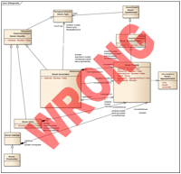
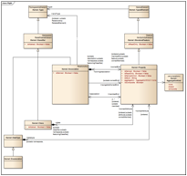

# 5-Minute Introduction

## TL;DR

- Kite9 is Visio, but automated.
- Kite9 is real-time, presentation-ready diagramming
- Kite9 is another tool in the data visualisation
arsenal.
- Kite9 is a business, name, an underlying technology and a software tool.

## Problem Statement: We've All Been There

Here is a key scenario:
- you are producing a work-flow diagram using **Microsoft Visio**, or **PowerPoint** to present in a meeting.
- It shows the order fulfillment process for your company for a given product.
- It starts easily enough, with some boxes connecting up different departments, and some connectors with arrows to show the flow of information and product around the company.
- However, as it gets more complicated, you spend less time on the problem itself (trying to model the system) and more time wrestling with the tool to make the model presentable and well laid out.

**Wouldn't it be great if somehow Visio did this for you?**

## UML

Visio, and other tools like it, are commonly used to produce "UML" software  diagrams.  UML is one of the libraries of symbols included in Visio.  But Visio is a terrible tool to use for UML.

Since software in development changes frequently, keeping UML diagrams up-to-date using
Visio is a chore, and is therefore only done when something needs to be presented.

Although there are better tools than Visio for generating UML diagrams,
the problem is endemic – producing good UML diagrams is work for an
artist, as you can see below.

Examples of Bad and Good UML Diagrams taken from Geert Bellekens' Blog
<http://geertbellekens.wordpress.com/2012/02/21/uml-best-practice-5-rules-for-better-uml-diagrams/>

## Problem Domain

Diagrams of any kind are sets of symbols in a presentation.  The information embedded in the
diagram is communicated in a number of ways.  Here are some:

- **Textual**:  The diagram may contain pieces of text, which explain what certain features mean.For example, on a map, towns are labelled with their names.
- **Symbolic**: Diagrams often contain symbols that convey meaning.  Taking the example of the map again, there is a special symbol for a church, a pub, a station and so on.  Generally, symbols are also explained in a key somewhere.
- **Topological**:  Topology is the way in which the elements on the diagram are connected.In the map example, I can see two places connected together by a road (say the A12).   In the UML diagram, the connections between the elements describe the relationships those elements have with each other.
- **Geographical**:  The position of the symbols on the diagram may convey meaning.  This is especially true on a most maps, where the aim is to try and replicate the geography of the real world on a much smaller scale. 

However, we've all drawn maps for people which don't have any real geographic information, but still show you **topologically** how to get from A to B.

UML diagrams convey no information *geographically*, as you can see in the
example below. But, certain geographical arrangements are *aesthetically* more pleasing than others:

Two Topologically identical UML diagrams.   The information contained in them is
the same, but the Geographical layout of the one below is aesthetically superior. (Taken from [Geert Bellekens' Blog](http://geertbellekens.wordpress.com/2012/02/21/uml-best-practice-5-rules-for-better-uml-diagrams).)

## Kite9's Solution

Kite9 is applicable for a subset of diagrams in which (like a UML diagram or an organisation chart) no information is being communicated geographically.

This means that there are multiple different geographical arrangements of the symbols, which will communicate the same information, and some arrangements are (a lot) better than others.